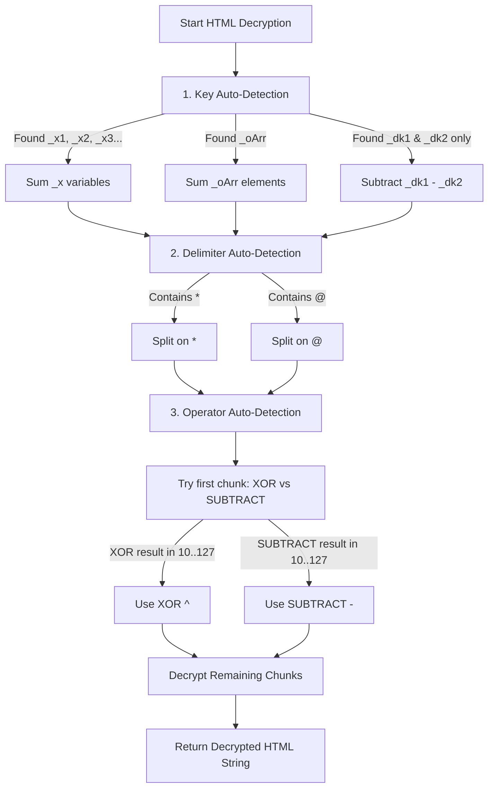

# CimaNow Watch Page Decryption Handover & Cheatsheet

This cheatsheet is written for developers and future AI agents to immediately understand, debug, and update the **CimaNow** decryption flow if the site changes its encryption parameters again.

---

## 1. High-Level Flow Summary

To play videos on CimaNow, the client must traverse a multi-step redirection and token-generation pipeline:
1. **Movie/Episode Page:** Scraped for the `freex2line` URL (e.g., `https://rm.freex2line.online/loadon/?link=...`).
2. **Loadon Page:** Contains redirects to a `redirectingfree` page.
3. **Redirectingfree Page:** Sets cookies and redirects to a blog post template page (e.g., `https://rm.freex2line.online/2020/02/blog-post.html`).
4. **Blog Post Page:** Contains a configuration block (`window._0x_cfg`) with a dynamic token.
5. **countdown bypass:** The client must wait **11 seconds** before calling `get-link.php?token=...` to bypass the server-side countdown guard.
6. **Watch URL Retrieval:** `get-link.php` returns a JSON object containing the watch URL: `https://cimanow.cc/.../watching/?token=...`.
7. **Obfuscated Watch Page:** Fetching the watch page returns HTML containing an inline Javascript block that dynamically decrypts and writes the actual player DOM elements.

---

## 2. Decryption Internals

The watch page contains a obfuscated script block containing the following key components:

### A. The Obfuscated Payload Variable
A massive string (often up to 3MB) composed of base64 chunks separated by a delimiter character.
```javascript
var _cff42 = 'MTM1MzY0*MTM1MzY0*MTM1MzY0*...';
```

### B. The Decryption Key
The decryption key is represented by integer variables in the HTML. Over time, CimaNow has evolved how this key is defined to throw off scrapers:
*   **Version A (Key-diff):** Two variables `_dk1` and `_dk2` are defined, and the key is their difference: `key = _dk1 - _dk2`.
*   **Version B (Array-sum):** An integer array `_oArr` is defined, and the key is the sum of its elements: `key = _oArr.sum()`.
*   **Version C (Decoy + dynamic local sum):** Decoy `_dk1` and `_dk2` variables are left in the HTML (but unused), while the real key is the sum of dynamically generated local variables inside the self-invoking decryption function (e.g., `var _x1=45132; var _x2=45132; var _x3=45132;` -> `key = 135396`).

### C. The Delimiter
The delimiter separates the base64 chunks in the payload:
*   **Old Delimiter:** `@` (e.g., `'MTM1MzY0@MTM1MzY0@...'`)
*   **New Delimiter:** `*` (e.g., `'MTM1MzY0*MTM1MzY0*...'`)

### D. The Mathematical Operator
Once a chunk is base64-decoded, all non-digit characters are removed, and the remaining number is processed with the key:
*   **Old Math:** Subtraction (`number - key`)
*   **New Math:** Bitwise XOR (`number ^ key`)

The resulting integers correspond to the character codes of the target HTML (e.g., `<` = 60, space = 32). The decoded string is injected into the DOM via `document.write(decodeURIComponent(escape(decryptedHtml)))`.

---

## 3. The Self-Learning / Auto-Detecting Architecture

To make the decryptor resilient to future changes, the logic inside [CimaNowProvider.kt](file:///Users/mohammad/AndroidStudioProjects/cloudstream-standard-v2/omarC/CimaNowProviderV2/src/main/kotlin/com/cimanow/CimaNowProvider.kt) uses three levels of auto-detection:



### Key Auto-Detection Order
```kotlin
// 1. Check for dynamic local sum (Version C)
val xVarMatcher = Pattern.compile("var\\s+(_x\\d+)\\s*=\\s*(\\d+)").matcher(html)
// 2. Fall back to array sum (Version B)
val oArrMatcher = Pattern.compile("var\\s+_oArr\\s*=\\s*\\[([\\d,\\s]+)\\]").matcher(html)
// 3. Fall back to key-diff (Version A)
val dk1Matcher = Pattern.compile("var\\s+_dk1\\s*=\\s*(\\d+);").matcher(html)
```

### Operator Auto-Detection
The first decoded chunk's digit value is run through both potential operators (`xor` and `-`). The compiler checks which operator yields a standard, printable character code (ASCII values `10..127` representing typical HTML layout and space characters):
```kotlin
val valXor = firstDigits xor key
val valSub = firstDigits - key
val useXor = if (valXor in 10..127) {
    true
} else if (valSub in 10..127) {
    false
} else {
    true // Fallback to XOR
}
```

---

## 4. Troubleshooting Future Changes

If CimaNow changes their watch page script and compilation/decryption fails:

1.  **Retrieve a Live Watch Page HTML:**
    Run the scratch script [fetch_cimanow_watch_page.py](file:///Users/mohammad/.gemini/antigravity-ide/brain/922da370-f832-46aa-bf3e-de950c295a4c/scratch/fetch_cimanow_watch_page.py) using an active watch URL (with token) from logs to save the raw HTML:
    ```bash
    python3 /Users/mohammad/.gemini/antigravity-ide/brain/922da370-f832-46aa-bf3e-de950c295a4c/scratch/fetch_cimanow_watch_page.py
    ```
2.  **Isolate the Script Block:**
    Locate the obfuscated `<script>` tag inside the saved HTML. Identify the new variable names, delimiters, or math formulas.
3.  **Update the Auto-Detection Rules:**
    *   If they change the variable prefix from `_x` to another prefix, adjust the `xVarMatcher` regex pattern in [CimaNowProvider.kt](file:///Users/mohammad/AndroidStudioProjects/cloudstream-standard-v2/omarC/CimaNowProviderV2/src/main/kotlin/com/cimanow/CimaNowProvider.kt).
    *   If they change the delimiter character, add the new character to the `delimiter` conditional block.
    *   If they introduce a new mathematical operation (e.g., addition or bitwise rotation), add the corresponding logic to the Operator Auto-Detection block.
