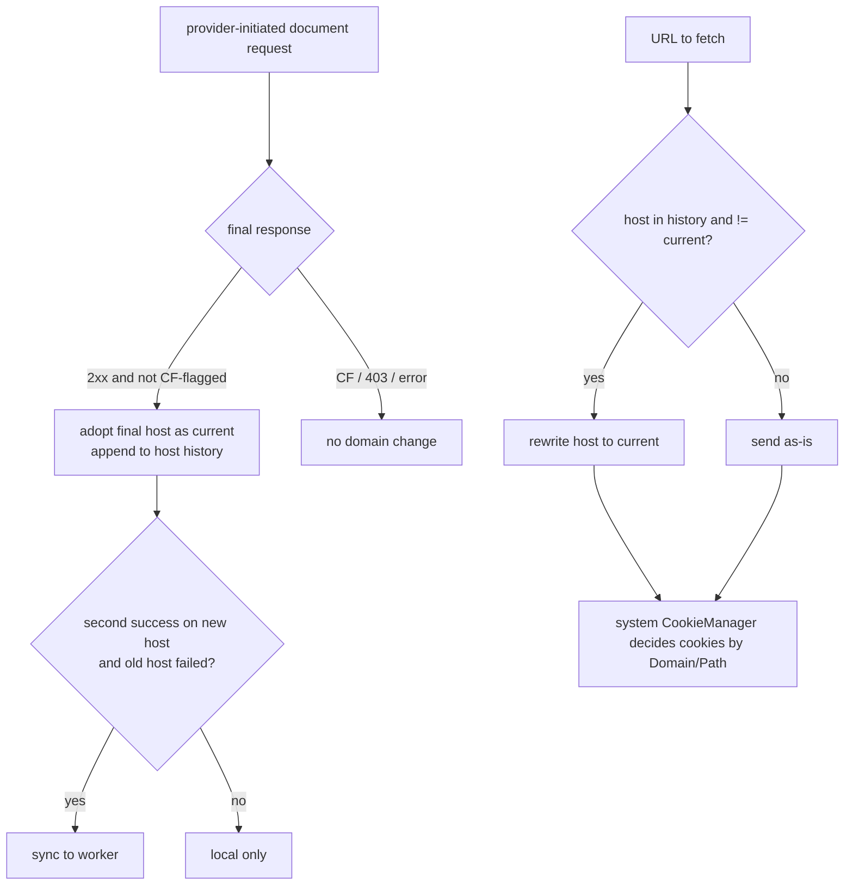
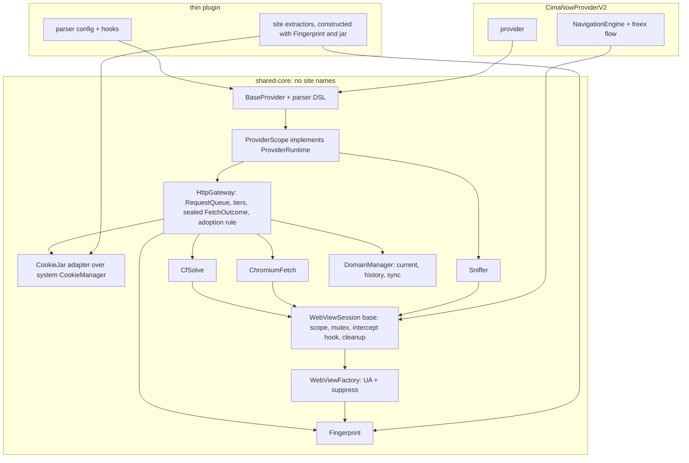

# Third-eye review of `shared-architecture-review.md`

Date: 2026-09-03. Reviewed against HEAD `50df2f90`. Scope: sections 9 to 11 of the plan (critique, P0 to P3 roadmap, open questions), checked against the code and against the owner's rules R1 (one UA), R2 (one fingerprint), R3 (no name-based domain logic), R4 (fewest concepts, single source of truth, explicit injection, small provider API). Every behaviour claim below cites a file:line that was read for this review; anything not read is marked unverified.

## 1. Verdict

- The diagnosis is accurate and well cited. Dead code, god objects, four cookie stores, two domain truths, string-matched errors, shipped debug behaviour: spot-checked and confirmed.
- The plan does not contain R1 or R2 as goals. UA and fingerprint appear only as a duplication row ("Chrome/120 UA literal, 6 copies") and one P1 line ("one `BrowserHeaders.build(session)`"). There is no owner for the fingerprint, no rule against literals, and nothing about the WebView side of the fingerprint. Section 2 lists 14 construction sites and five independent divergences.
- The plan violates R3 twice. P1 proposes "One `DomainUtils` (registrable domain, `www.` policy, multi-part TLDs)", which centralises the heuristics R3 forbids. P0 proposes the worker validate "with the same rules as `isValidProviderDomain`", which keeps a denylist as a decision point. The plan also leaves `SessionProvider.domainAliases`, `areDomainsRelated`, `getCookiesForDomain`, `ProviderConfig.trustedDomains`, and the three `allowedDomains` parameters undeleted.
- The P1 cookie direction adds sync code instead of deleting a store. "`SessionState` for cookies, system `CookieManager` becomes a sync target" keeps two stores. The WebViews already read the system `CookieManager` (`CfBypassEngine.kt:517-520`, `ChromiumFetcher.kt:355`, `SnifferExtractor.kt:359`). Make it the only jar; OkHttp gets a `CookieJar` adapter. Cookie scope then follows each cookie's own `Domain`/`Path` attributes, the only scoping rule R3 permits.
- The P2 split (`HttpGateway` / `SessionManager` / `WebViewFacade`, `BaseProvider` holds all three) has no identity object and exposes three surfaces to 41 providers. It needs one `Fingerprint` value and one provider-facing interface; `SessionManager` collapses into `DomainManager` once cookies leave it.
- Phase ordering is mostly right with two exceptions: fingerprint unification is cheap and belongs in P0, and the `WebViewSession` base must land before the `ProviderHttpService` split because tiers 2 and 3 depend on it.
- P3 (core in the APK) is the right end state. It names the cardinality prerequisite but not plugin/app version skew, which is the larger operational risk.

## 2. Fingerprint inventory

Paths under `shared/src/main/kotlin/com/cloudstream/shared/` unless noted.

| Location | Request type | UA source | Fingerprint headers set | Divergence |
|---|---|---|---|---|
| `service/ProviderHttpService.kt:839-856` `executeDirectRequest` | OkHttp GET, tier 1 | `sessionState.userAgent` | UA, Referer, Accept html, `Accept-Language: en-US,en;q=0.9`, `Sec-Ch-Ua` via `WebConfig.buildSecChUa`, `?1`, `"Android"`, UIR, Sec-Fetch none/navigate/document/?1 | HTTP/1.1 forced (`:914`); Accept-Encoding left to OkHttp; Title-Case hint names |
| `session/SessionState.kt:78-98` `buildHeaders`, used by `executePostRequest :1023` | OkHttp POST | `sessionState.userAgent` | same set; Referer always `https://$domain/` | `Sec-Fetch-Site: none` on a POST (`SessionState.kt:89`); HTTP/1.1 (`:1033`) |
| `service/ProviderHttpService.kt:382-386` `getRaw` | OkHttp GET | `sessionState.userAgent` unless caller sets UA | UA + three `Sec-Ch-Ua*` | No Accept-Language; caller UA suppresses hints (deliberate, documented at `:366-379`); HTTP/1.1 (`:398`) |
| `service/ProviderHttpService.kt:812`, `:841-850` | image headers | `sessionState.userAgent` | `:812` UA+Cookie+Referer; `:841` full image set | two shapes for one purpose |
| `strategy/StrategyTypes.kt:34-57` | dead | param | fourth copy of the header block | dead, still dexed |
| `network/ChromiumFetcher.kt:238-239, :259` | WebView tier 2 | `headers["User-Agent"] ?: WebConfig.getCachedUserAgent()` | `userAgentString`; `X-Requested-With: ""` (`:160`); forwards the whole OkHttp header map as `loadUrl` extras (`:162-166`) | No `RequestedWithHeaderControl.suppress` call (only caller is `NavigationEngine.kt:1161`), so this WebView sends `sec-ch-ua: "Android WebView"` (captured on the wire per `RequestedWithHeaderControl.kt:25-27`). `""` is documented as the wrong value at `RequestedWithHeaderControl.kt:113-127` |
| `webview/CfBypassEngine.kt:95` | WebView CF solve | `userAgent` param = `sessionState.userAgent` (`ProviderHttpService.kt:1114`) | `userAgentString` only | Same brand leak, no suppress call; `X-Requested-With` uncontrolled |
| `webview/VideoSnifferEngine.kt:424` | WebView sniff | `SnifferExtractor.kt:141-150`: `WebSettings.getDefaultUserAgent` minus `; wv)` | `userAgentString` only | Skips `WebConfig`'s "Mobile" insertion (`WebConfig.kt:37-39`), so the sniffer UA differs from the session UA whenever the device default lacks "Mobile"; same brand leak |
| `webview/NavigationEngine.kt:1109, :2770` WebView; `:1465-1472, :2080-2088` HttpURLConnection re-issue | CimaNow only | param | `sec-ch-ua: "Not(A:Brand";v="99", "Google Chrome", "Chromium"`; Accept-Language from `Locale.getDefault()` (`:1387-1393`); `X-Requested-With: " "` (`:3063`); `suppress()` at `:1161` | Brand string and order differ from `WebConfig.buildSecChUa` (`"Not_A Brand";v="8", "Chromium", "Google Chrome"`, `WebConfig.kt:78-80`); only WebView in the repo with real-Chrome hints |
| `webview/RequestedWithHeaderControl.kt:157-170` | WebView UA metadata | `WebSettings.getDefaultUserAgent` | brands `Not;A=Brand`/8, Chromium, Google Chrome, full version | third brand spelling |
| `extractors/SnifferExtractor.kt:389-400` | `ExtractorLink` headers to player | sniffer UA | UA, lower-case `sec-ch-ua*`, `Accept: */*`, Sec-Fetch empty/cors/cross-site, merged cookies (`:359-373`, system jar plus `SessionProvider.getCookies()`) | hint names lower-case here, Title-Case on the OkHttp path |
| `network/MediaUrlValidator.kt:114-120, :168-171` | validation GET | source UA or session UA | UA, `Accept-Encoding: identity`, `Accept: */*` | Private `OkHttpClient`, not `app.baseClient` (which carries the user's DNS choice, `app/.../network/RequestsHelper.kt:27-48`); no hints |
| `extractors/LarozaExtractor.kt:39`, `AlbaPlayerExtractor.kt:83`, `CswruExtractor.kt:44`, `OkPrimeExtractor.kt:26`, `VertyuzExtractor.kt:30`, `SavefilesExtractor.kt:33` (fallback), `ArabHdExtractor.kt:88`, `EstreamExtractor.kt:87`, `EarnVidsExtractor.kt:160`, `FaselHDExtractor.kt:51` (fallback), `OdnoklassnikiApiExtractor.kt:33`, `ui/DrmPlayerDialog.kt:218`, `webview/WebViewFlowHelper.kt:14` (dead) | extractor OkHttp / WebView | literal | Windows desktop Chrome 116/120, `Chrome/120` without minor version, Android Chrome 124/150, Chrome 91 | A Windows UA sent alongside cookies minted by an Android WebView. `LarozaExtractor.kt:39` passes it into `service.getDocument`, so the session path itself carries the foreign UA |
| Provider modules: `Cimalight/cimalight.kt:25` (146), `Topcinema/topcinemaProvider.kt:38` (142), `eseek/GessehProvider.kt:40, :221` (142 and 146 in one file), `Anim3rb:259` (124), `Tuniflix:264`, `Shahid4u:54`, `CimaLeek:305`, `Krmzy:196`, `Witanime:715` | provider OkHttp | literal | mixed | outside the plan's scope, inside R1's |
| App: `app/.../network/RequestsHelper.kt:60` `DEFAULT_HEADERS` | any `app.get` without a UA | app constant `USER_AGENT` (value not read for this review) | UA | Extractors that call `app.get(url)` without a UA send the app's UA, not the WebView UA |
| `util/WebConfig.kt:24` fallback, read by `SessionProvider.getUserAgent :204`, `SessionStore.load :65`, `SessionState.initial :39` | bootstrap | literal Pixel 7 / Chrome 131 | UA | Anything that runs before `WebConfig.getUserAgent(context)` (`ProviderHttpService.create :1385`) gets a hardcoded UA |

API-client UAs (`YoutubeProvider/innertube/InnerTubeConfig.kt:32`, `Viu/viu.kt:302`, `Animewitcher:39`, `Watanflix:214`) are not browser requests. Whether R1 covers them is Open question 2.

### Minimum change set for identical fingerprints

1. One `Fingerprint` value object, built once from `WebSettings.getDefaultUserAgent(appContext)` and `Locale.getDefault()`: `userAgent`, `chromeFullVersion`, `brands` (one spelling), `acceptLanguage`. No literal anywhere. If WebView is unavailable, fail with a clear error instead of substituting a Pixel 7.
2. One OkHttp `Interceptor` on the single shared client that applies UA, `sec-ch-ua*`, Accept-Language, and a default `Accept` for HTML requests. Delete the four header blocks (`ProviderHttpService :839, :356-391`, `SessionState :69-98`, `StrategyTypes :34-57`).
3. One `WebViewFactory.create(activity, fingerprint)` that sets `userAgentString` and calls `RequestedWithHeaderControl.suppress`. Use it at the four creation sites (`CfBypassEngine :87`, `VideoSnifferEngine :409`, `ChromiumFetcher :252`, `NavigationEngine :1101`).
4. `Fingerprint.playbackHeaders(referer, origin, cookieHeader)` used by `SnifferExtractor :389-400` and `AlbaPlayerExtractor :212`, and by `MediaUrlValidator`, which must also use `app.baseClient`. `OdnoklassnikiApiExtractor` must stay on a Chrome-family UA per its own note at `:25-30`; the device UA is Chrome, so it qualifies.
5. Delete `ProviderConfig.userAgent` (`ProviderConfig.kt:20`) and `BaseProvider.userAgent` (`BaseProvider.kt:56`). R1 leaves no room for a per-provider browser UA.
6. Accept-Language from device locale in OkHttp, because the WebViews already send the device locale and `NavigationEngine :1387-1393` already builds it that way; delete the five `en-US` literals.

Where it lives: `core/Fingerprint.kt`, constructed by whatever holds the app `Context` (`PluginContext` today, the app after P3), passed by constructor to the OkHttp interceptor, `WebViewFactory`, `ProviderScope`, and extractors. `WebConfig` and `SessionProvider` are then deleted.

## 3. Domain handling under R3

### What to delete

- `session/SessionProvider.kt` entirely: `domainAliases :21`, `extractBaseDomain :44`, `MULTI_PART_TLDS :72`, `areDomainsRelated :86`, `addDomainAlias :105`, `getCookiesForDomain :136`. Callers: `ProviderHttpService :141, :178, :223, :362, :814, :886, :918`, `BaseProvider :410-417`, `SnifferExtractor :371`, `LazyExtractor :56, :339`, `SavefilesExtractor :33`, `VKVideoEmbed :37-38`, `CimaNowProvider` (not read).
- `DomainManager.isValidProviderDomain :167` as a decision; `DENYLISTED_HOSTS :157` with it. A syntactic "is a hostname" check may stay; it decides nothing about which site.
- `ProviderConfig.trustedDomains :29` and the `contains` test at `ProviderHttpService :1061-1063` that decides whether `Set-Cookie` is ingested. With the system jar as the only store, ingestion is the jar's job.
- `RequestQueue.kt:112-121` `allowedDomains` (`takeLast(2)`); `CfBypassEngine.kt:53, :209`, whose miss branch allows the navigation anyway (`:216-217`), so the parameter has no effect; `NavigationEngine.kt:210, :2634-2641`; `WebViewFlowHelper :16` (dead).
- `removePrefix("www.")` at `ProviderHttpService :1312` and `RequestQueue :291`. `www.x` and `x` are two hosts. If a site redirects between them, the adoption rule records the target.
- From the plan: the P1 `DomainUtils` line, and the P0 phrase "with the same rules as `isValidProviderDomain`". Keep the plan's provider-name allowlist and shared secret for the worker; they are about who may write, not which domain looks plausible.

### What replaces it

Three facts, one owner each, one behavioural rule each.

**Current domain** (owner `DomainManager`, per provider). Adopt host H only when a provider-initiated `document()` request (not an extractor, image, or intercepted subresource) ends with a 2xx that `CloudflareDetector.isBlocked` does not flag. H is the final URL host of the OkHttp redirect chain, a meta-refresh target that then passes the same test, or a CF solve's final URL that passes the same test. This covers the observed poisoning (`docs/search-architecture.md` root cause A: challenge redirect to `cloudflare.com`) without naming Cloudflare, because a challenge page is flagged. It covers the FaselHD proxy hop (`RequestQueue.kt:104-107`) because the proxy response is blocked. If a site is later observed serving a 2xx non-CF interstitial on a foreign host, add "the parser yields at least one item" to the test then, not before.

**Host history** (owner `DomainManager`, persisted ordered list of hosts this provider was adopted at). Rewrite a URL's host to the current domain only if its host is in the history. Today `rewriteUrlIfNeeded :1147-1170` rewrites any host that differs from the current domain, and `RequestQueue.rewriteFollowerUrl :281-288` does the same. History is the minimum that keeps the old-domain-link case (`ProviderHttpService :218-221`) working without a name heuristic and without rewriting third-party hosts.

**Cookies** (owner `android.webkit.CookieManager`, the only jar). OkHttp `CookieJar`: `loadForRequest` = `getCookie(url)`, `saveFromResponse` = `setCookie(url, header)`. Scope is whatever the `Set-Cookie` said. `SessionState` loses `cookies`, `cookieTimestamp`, `fromWebView`; `SessionStore`, `CookieLifecycleManager`, `syncCookiesToSystemCookieManager`, `snapshotSession`, `restoreSession`, and `updateCookies` are deleted. Re-solve invalidation expires the current host's cookies only (set each name with `Max-Age=0` for that URL); never `removeAllCookies`. Whether sibling hosts keep receiving `cf_clearance` under this rule depends on the `Domain` attribute Cloudflare sets; not verified in this repo and listed as a verification step in section 6.

**Remote sync**: push only after the new host passed the adoption test twice and the old host redirected or hard-failed in the same session. Behavioural, not name-based; one device that misdetects once cannot rewrite the config.

**RequestQueue** without names: leaders keyed by exact host. On leader success the adoption rule may change the current domain; followers whose host is in history and differs from the current domain are rewritten, others run as-is. `solveCfAndRequest(url, allowedDomains)` becomes `solveCf(url)`.



## 4. Clean-architecture assessment of the P2/P3 target

The proposed split is a reasonable cut of `ProviderHttpService` but has four gaps against R4.

1. No identity component. Without `Fingerprint`, "one `BrowserHeaders.build(session)`" is a function callers may forget, which is how the four copies arose.
2. `SessionManager` keeps cookies. With the system jar, session is `{ currentDomain, hostHistory }`, which is `DomainManager`. Two names for one fact.
3. `BaseProvider` holding three collaborators exposes three surfaces. One interface is enough.
4. "Per-call `ExtractorContext`" is not possible: `ExtractorApi.getUrl(url, referer, subtitleCallback, callback)` is fixed by CloudStream. Constructor injection is the only option. Of the ten Holder-using extractors, only `LarozaExtractor :32` needs the provider gateway (`service.getDocument`); the rest need the fingerprint and the jar, which are process-wide.

Corrected model, fewer concepts than the plan's:



Dependency direction: plugins depend on core; core depends on Android and CloudStream only; nothing in core names a site or a brand string except what `Fingerprint` derives at runtime. The app `Context` and activity are the only inputs from outside, replacing `PluginContext`, `ActivityProvider`, `ProviderHttpServiceHolder`, `SessionProvider`, `WebConfig`, and `ProviderHttpService.instances`.

Per-provider scope vs singletons: `ProviderScope(config, context, activityProvider)` owns `DomainManager`, `HttpGateway`, and the three WebView sessions for that provider. `Fingerprint` and the jar are process-wide because there is one device WebView and one cookie store. The existing circuit breaker stays inside `HttpGateway`; no change to its keying is proposed.

Provider-author API (everything a thin provider or CimaNow sees):

```kotlin
interface ProviderRuntime {
    val domain: String
    fun url(path: String): String
    suspend fun document(pathOrUrl: String, headers: Map<String,String> = emptyMap(), solveCf: Boolean = true): Document
    suspend fun post(pathOrUrl: String, form: Map<String,String>, headers: Map<String,String> = emptyMap()): Document
    suspend fun raw(url: String, headers: Map<String,String> = emptyMap(), cookies: Boolean = true): Response
    suspend fun sniff(url: String, exit: ExitCondition, mode: Mode = Mode.HEADLESS): List<CapturedLink>
    fun imageHeaders(): Map<String,String>
    fun playbackHeaders(url: String, referer: String?): Map<String,String>
}
```

`solveCf = false` replaces `getDocumentNoFallback :752`, `ProviderConfig.skipHeadless :26`, `webViewEnabled :23`, and the string-matched second CF path (`ProviderHttpService :690-709`). `raw` is kept because Krmzy and TukTukcima depend on it (`ProviderHttpService :366-373`). Nothing else is added.

WebView engines: `WebViewSession` owns creation via `WebViewFactory`, a `CoroutineScope` tied to the session, a `Mutex`, a `@Volatile` delivery flag, the intercept hook, HTML and cookie extraction, and cleanup. `CfSolve`, `ChromiumFetch`, `Sniffer` are subclasses. CimaNow's `NavigationEngine` becomes a fourth subclass in its plugin and drops its own brand string (`:2086`) and Accept-Language builder (`:1387`).

## 5. Plan corrections

1. P0 add: replace every UA literal under `shared/` with `Fingerprint.userAgent`; delete `ProviderConfig.userAgent` and `BaseProvider.userAgent`. Mechanical and compile-guided.
2. P0 add: call `RequestedWithHeaderControl.suppress` at the `CfBypassEngine :87`, `VideoSnifferEngine :409`, and `ChromiumFetcher :252` creation sites. Today only `NavigationEngine :1161` does, so the CF solve advertises `"Android WebView"`.
3. P0 edit: worker validation is a syntactic hostname check, the provider allowlist, and the secret. Drop "same rules as `isValidProviderDomain`".
4. P0 add: one brand spelling. `WebConfig.buildSecChUa :78`, `NavigationEngine :2086`, `RequestedWithHeaderControl :164` disagree; `RequestedWithHeaderControl` is what the WebView actually sends, so the other two follow it.
5. P1 remove: "One `DomainUtils` (registrable domain, `www.` policy, multi-part TLDs)". Replace with the deletions in section 3. Exact host equality only.
6. P1 replace: "`SessionState` for cookies, `CookieManager` sync target" with "system `CookieManager` is the only jar; OkHttp `CookieJar` adapter; `SessionState` loses cookies; `SessionStore` and `CookieLifecycleManager` deleted."
7. P1 add: `Fingerprint`, OkHttp interceptor, `WebViewFactory`; delete `WebConfig` and the four header blocks. This is the R2 deliverable and it is absent.
8. P1 add: the adoption rule in one place (`HttpGateway`), replacing `checkAndUpdateDomain :1174`, `RequestQueue :85, :132`, `handleMetaRefreshRedirect :1199`, `BaseProvider.handleDomainDifference :398`.
9. P1 add: Accept-Language from device locale in OkHttp; decide HTTP version per tier explicitly (currently forced HTTP/1.1 at `:398, :914, :1033` with no recorded reason).
10. P1 add: `MediaUrlValidator` uses `app.baseClient` and `Fingerprint.playbackHeaders`; delete its private client (`:114-120`).
11. P1 replace: "one `BrowserHeaders.build(session)`" with the interceptor. A build function callers may skip is the current failure mode.
12. P2 reorder: `WebViewSession` base before the `ProviderHttpService` split.
13. P2 edit: the split is `Fingerprint`, `DomainManager` (absorbs session), `HttpGateway`, `WebViewSession` + three subclasses, behind one `ProviderRuntime`. Drop `SessionManager` and `WebViewFacade`.
14. P2 edit: extractors take their dependencies by constructor; `registerSharedExtractors` becomes a per-plugin list of constructed instances. Delete `ProviderHttpServiceHolder`.
15. P2 add: a fingerprint parity check. Unit tests can assert the interceptor output and `playbackHeaders`; WebView tiers need an on-device check against a local server (WebView does not run under Robolectric; unverified whether the repo's test setup can host one).
16. P3 add: an API version handshake. Plugins declare `requiresCoreApi`; `BaseProvider` refuses to load with a visible message on mismatch. Plugins update from the `builds` branch independently of app releases (`docs/README.md:12-14`), so skew is certain.

## 6. Risks the plan underestimates

**Core in the APK changes more than cardinality.** Once `shared` ships in the APK, plugin and app versions skew independently and every core API change can strand not-yet-updated plugins at class-load time. The plan has no compatibility mechanism (correction 16). Whether the app build minifies is not verified here; if it does, the reflection in `RequestedWithHeaderControl` (boundary-interface casts, `:254-262`) and `LazySearchConfig` (per `docs/search-architecture.md`, not read) need keep rules.

**"Unified fingerprint" has a floor.** OkHttp runs on Conscrypt (`app/.../network/RequestsHelper.kt:23`), the WebView tiers on Chromium's stack, and ExoPlayer on Java TLS. `ChromiumFetcher.kt:16-21` exists because those TLS fingerprints differ; no header change closes that. Realistic meaning of R2: identical HTTP-layer identity (UA, client hints, Accept-*, `X-Requested-With` policy), one cookie jar, and one owner. Which tier should be the default is a cost question (tier 2 is main-thread WebView, 1 to 3 s per `ChromiumFetcher.kt:24`) and is Open question 4, not a recommendation.

**Forwarding the OkHttp header block into a WebView navigation.** `ChromiumFetcher :162-166` passes the Kotlin-built `Sec-Ch-Ua`, `Sec-Fetch-*`, and `Accept-Language` as `loadUrl` extras into a navigation Chromium already decorates. How Chromium merges them is not verified here; the safe change is to forward only Referer and caller-specific headers.

**Deleting aliases changes behaviour that was added for FaselHD.** `ProviderHttpService :218-221` documents old-domain episode links (`w312x` vs `w318x` hosts). Under the history rule a never-seen sibling host is not rewritten and receives whatever the jar has for it. That works only if `cf_clearance` carries a parent `Domain` attribute, which `SessionState.kt:113-115` asserts ("UA-bound, not domain-bound") but nothing in the repo verifies. Test on device before deleting; if a site sets host-only cookies, the fix is a provider-level hook, not a global heuristic.

**The system jar is shared with the app.** `app/.../network/CloudflareKiller.kt:37` calls `CookieManager.getInstance().removeAllCookies(null)`. Once providers depend on the jar, that call wipes every provider session. The app must stop calling it, or scope it, before P1 item 6 lands.

**P0 search fix is a week, not a day.** Deleting the pageless overloads breaks 22 providers at compile time and each needs a decision. Budget it.

## 7. Open questions for the owner

1. `docs/README.md` fact 4 says keep the `*.cloudflare.com` denylist through any refactor; R3 says no denylist decisions. Is the behavioural adoption rule acceptable as the replacement, with the denylist demoted to a log-only assertion?
2. Does R1 cover API-client UAs (InnerTube, Viu, Algolia, Odnoklassniki `srcAg`)? Proposed reading: browser-shaped requests only, API clients marked explicitly in code.
3. Accept-Language: follow the device locale (matches the WebViews, varies per user) or fix one locale across all tiers (then it must also be set on the WebViews)?
4. Default tier for CF-fronted providers: OkHttp first (fast, different TLS from the solve WebView) or Chromium first (same TLS as the solve, main-thread cost per request)? The code has no data on whether switching tiers under one clearance hurts; if you have logs, they decide this.
5. Re-solve invalidation will expire only the current host's cookies. Is losing the ability to wipe the whole jar from provider code acceptable, and can `CloudflareKiller.kt:37` be changed in the app?
6. For P3, how many older plugin builds must a new app keep loading? This sizes the compatibility layer.
