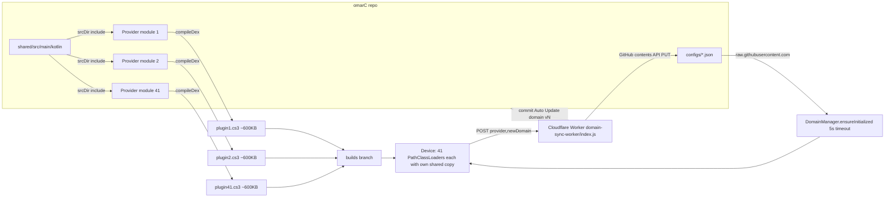
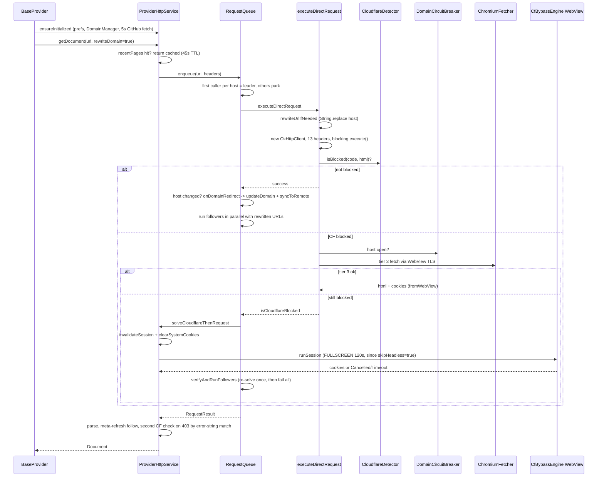
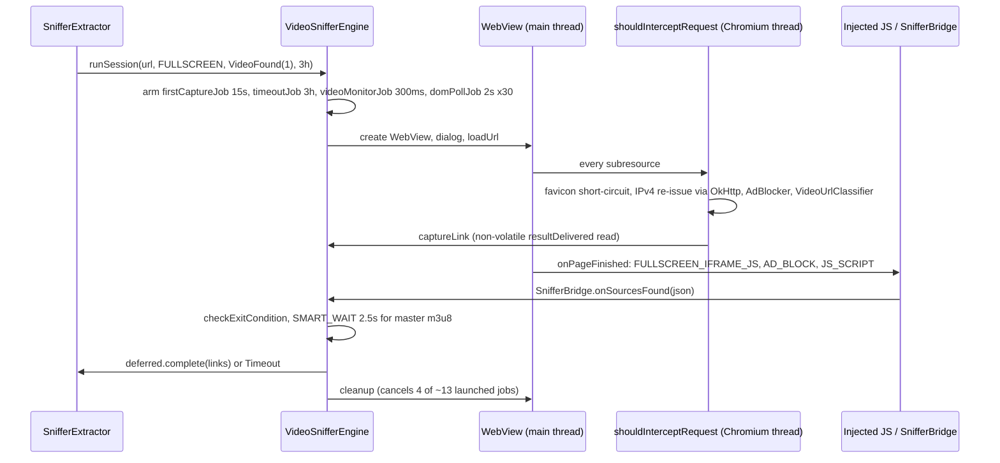
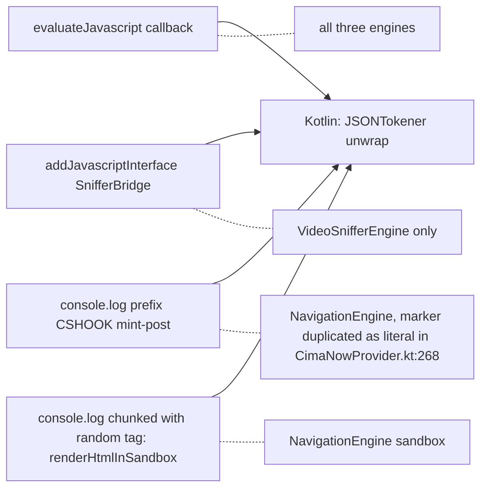
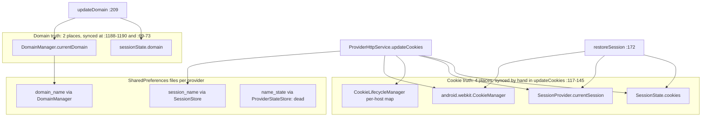

# `shared/` Architecture Review

Date: 2026-09-03. Scope: `shared/src/main/kotlin/com/cloudstream/shared/**`, its build wiring, and how the 41 provider plugins consume it. All line references are against the current `main` (HEAD `50df2f90`).

## 1. Summary

- `shared/` is 25.7k lines of Kotlin that every provider plugin compiles in via `kotlin.srcDir("../shared/src/main/kotlin")`. It is not a Gradle module and has no version.
- Because the CloudStream gradle plugin dexes project classes only, each of the 41 `.cs3` files carries a private copy of all of `shared`. A 225-line provider ships a 1.5 MB dex.
- All 41 providers extend `BaseProvider`; all parsers extend `NewBaseParser`. The thin declarative model works (MyCima is 225 lines). The heavy end has left the framework (CimaNow is 4,036 lines and drives `NavigationEngine` directly).
- Verdict: the *intent* (one HTTP gateway, one session, declarative parsers, self-healing domains) is right. The *implementation* is a copy-paste library grown by accretion around two or three sites, with two abandoned design generations still compiled in, undefined state ownership, ad hoc concurrency, and debug code shipping to users.
- Top problems, ranked:
  1. **Live regression**: 22 providers' custom search paths are unreachable since the pagination refactor (`BaseProvider.kt:166,206-247,257`).
  2. **Release safety**: WebView remote debugging is on, full request headers are echoed to postman-echo.com, HTML pages are dumped to external cache, the domain-sync worker trusts any POST.
  3. **God objects**: `ProviderHttpService` (1,406 lines, 9 collaborators) and `NavigationEngine` (4,410 lines, one consumer, hardcoded cimanow/freex branches).
  4. **Cost model**: ~2.4k lines of dead code and ~40 extractors dexed 41 times; 21 plugins never register the extractors they ship.
  5. **State and concurrency**: cookies live in four places, domain in two; engines have no mutex; non-volatile flags cross threads; blocking I/O inside `suspend`.

## 2. How `shared` reaches a plugin

`shared/` has no `build.gradle.kts`, so `settings.gradle.kts:6-10` skips it. Every provider module adds it as a source directory (`LarozaProvider/build.gradle.kts:4-10`, `CimaNowProviderV2/build.gradle.kts:26-32`, identical in all 41). The comment at `CimaNowProviderV2/build.gradle.kts:11-20` records why: the CloudStream gradle plugin's `compileDex` dexes project classes only, so a Gradle dependency would never reach the device.

| Metric | Value |
|---|---|
| `shared/src/main` | 25,693 LOC, 82 files |
| All 41 providers' own code | 24,839 LOC |
| `MyCimaProvider` own code | 225 LOC |
| `MyCimaProvider.cs3` classes.dex | 1,523,388 bytes |
| Typical `.cs3` size | 590 to 620 KB |
| Total over 41 plugins | 24.7 MB |
| Copies of `SessionProvider` class at runtime | 41 (one per plugin classloader) |
| Version of `shared` | none |
| R8 / ProGuard | none |

Consequences: no visibility boundary (`internal` is per plugin module, so effectively public); no tree shaking; every `shared` change silently changes all 41 plugins but only rebuilt and redownloaded ones get it (`docs/README.md:12-14`). CI rebuilds everything on push to `main` and force-pushes to `builds`, so lockstep holds only while users update every plugin.

Domain distribution is decoupled from plugin builds by design: `.github/workflows/build.yml:14-16` ignores `configs/**`, so `[Auto]` commits do not trigger rebuilds. Two gaps: `CimaNowProviderV2` sets `githubConfigUrl = ""` and opts out, and only 23 config files exist for 41 providers, so about 18 providers fetch a 404 and fall back silently (`DomainManager.kt:81-84`).

## 3. Component map

```mermaid
flowchart TB
  classDef cycle stroke:#d33,stroke-width:3px,color:#d33
  classDef dead stroke-dasharray: 5 5,color:#888

  BP[provider/BaseProvider]
  PC[provider/ProviderConfig + UNIFIED_USER_AGENT]
  HS[service/ProviderHttpService 1406 LOC]
  HH[service/ProviderHttpServiceHolder global slot]
  RQ[queue/RequestQueue]
  SS[session/SessionState]
  SP[session/SessionProvider global object]
  ST[session/SessionStore prefs]
  PSS[session/ProviderStateStore]
  DM[domain/DomainManager prefs + GitHub]
  CK[cookie/CookieLifecycleManager write-only]
  CF[cloudflare/CloudflareDetector]
  WC[util/WebConfig UA cache]
  NP[parsing/NewBaseParser + ParserInterface]
  OP[parsing/BaseParser, GenericParser, ParserSpec]
  STR[strategy/DirectHttpStrategy, StrategyTypes]
  CFE[webview/CfBypassEngine]
  VSE[webview/VideoSnifferEngine]
  NE[webview/NavigationEngine 4410 LOC]
  WFH[webview/WebViewFlowHelper]
  CHF[network/ChromiumFetcher]
  NET[network/Dns, MediaUrlValidator, IpPinned]
  EX[extractors/* 35 files]
  SE[extractors/SnifferExtractor]
  AP[android/ActivityProvider, PluginContext]

  BP --> HS
  BP --> HH
  BP --> NP
  BP --> PC
  BP --> AP
  HS --> RQ
  RQ -->|callbacks| HS
  HS --> SS
  HS --> SP
  HS --> ST
  HS --> DM
  HS --> CK
  HS --> CF
  HS --> WC
  HS --> NP
  HS --> CFE
  HS --> VSE
  HS --> NE
  HS --> CHF
  HS --> NET
  SS --> PC
  SP --> PC
  PC --> WC
  NP -->|SnifferSelector| EX
  EX --> HH
  HH --> HS
  SE --> VSE
  CFE --> AP
  VSE --> AP
  NE --> AP
  CHF --> AP

  class RQ,HS,HH,EX,SS,SP,PC cycle
  class PSS,OP,STR,WFH dead
```

Cycles (red): `ProviderHttpService <-> RequestQueue` via injected callbacks (`ProviderHttpService.kt:66-75`); `session -> provider -> util` through `UNIFIED_USER_AGENT` (`ProviderConfig.kt:77`); `ProviderHttpService -> ParserInterface -> extractors -> ProviderHttpServiceHolder -> ProviderHttpService`. Dashed: whole files with zero inbound references.

| Component | LOC | Responsibility | Live consumers | Verdict |
|---|---:|---|---|---|
| `provider/BaseProvider` | 778 | MainAPI surface: mainPage, search, load, 4-phase loadLinks | 41 providers | keep, fix search dispatch, shrink |
| `service/ProviderHttpService` | 1,406 | HTTP gateway + session + cookies + domain + CF + cache + WebView proxy + image headers | 41 via BaseProvider, 10 extractors via Holder | split (P2) |
| `service/ProviderHttpServiceHolder` | 54 | single global instance slot | 10 extractors, BaseProvider | replace with explicit context |
| `queue/RequestQueue` | 343 | per-host leader/follower dedup, domain mutex | ProviderHttpService | keep, decouple callbacks |
| `session/SessionState` | 170 | immutable cookies+domain+UA | ProviderHttpService | keep as the one truth |
| `session/SessionProvider` | 246 | global mutable session + domain aliases | ProviderHttpService, BaseProvider | merge into SessionState owner |
| `session/SessionStore` | 114 | prefs `session_<name>` | ProviderHttpService | keep |
| `session/ProviderStateStore` | 187 | parallel prefs `<name>_state` | none | delete |
| `domain/DomainManager` | 179 | prefs + validation + GitHub config + worker sync | ProviderHttpService | keep, fix detached scope |
| `cookie/CookieLifecycleManager` | 112 | per-host cookie TTL store | written by 2 sites, read by 0 | delete or make it the cookie truth |
| `cloudflare/CloudflareDetector` | 97 | CF markers | ProviderHttpService, CfBypassEngine | keep, tighten patterns |
| `strategy/*` | 271 | RequestStrategy abstraction | none (only `VideoSource` used) | delete, keep `VideoSource` |
| `parsing/NewBaseParser + ParserInterface` | 383 | live declarative parser | 41 parsers | keep, rename |
| `parsing/BaseParser, GenericParser, ParserSpec` | 578 | two abandoned parser generations | none | delete |
| `webview/CfBypassEngine` | 587 | headless/fullscreen CF solve | ProviderHttpService | merge into common WebViewSession |
| `webview/VideoSnifferEngine` | 2,030 | fullscreen sniff + player handover | SnifferExtractor, 5 providers | keep, split, add mutex |
| `webview/NavigationEngine` | 4,410 | step interpreter, proxy, popup sink, sandbox | CimaNow only | move into CimaNowProviderV2 |
| `webview/WebViewFlowHelper` | 683 | cimanow navigation steps | none | delete |
| `webview/NavigationSessionPolicy` | 115 | cookie/redirect policy seam | engines | keep (good) |
| `network/ChromiumFetcher` | 383 | WebView as HTTP client (tier 3) | ProviderHttpService | keep, fix reuse cache |
| `network/Dns, IpPinned*, MediaUrlValidator` | 383 | IPv4/6 policy, URL pinning, validation | FaselHD, engines | keep, unify v4/v6 |
| `extractors/*` | ~7,000 | 35 site extractors + sniffer | 20 plugins register | keep, split per plugin |
| `android/ActivityProvider, PluginContext` | 167 | Activity/Context lookup | engines, BaseProvider | keep, make volatile |
| `ui/*` | ~2,400 | YouTube player, DRM dialog, TV mouse | YouTube, Laroza, NavigationEngine | move to owning plugins |

## 4. Request lifecycle: `getDocument`

What is wrong on this path:

- **Two CF paths.** The queue path solves CF at `RequestQueue` level; `getDocument` then re-checks 403 + markers and re-enqueues a solve at `ProviderHttpService.kt:690-709`, gated by matching `result.error?.message` against four literal strings produced in `RequestQueue.kt:154,230` and `ProviderHttpService.kt:1137`. Renaming a message re-enables a thundering herd.
- **Blocking I/O in suspend.** `executeRequestHelper` (`ProviderHttpService.kt:1055-1058`), `getRaw` (`:402`), `MediaUrlValidator.kt:134`, `Ipv4PinnedInterceptor.kt:44` call `execute()` without `withContext(Dispatchers.IO)`.
- **Client churn.** A fresh `OkHttpClient` per request at `:397`, `:913`, `:1032`, and per URL in `MediaUrlValidator.kt:114-120`, which also skips `app.baseClient` so validation runs under a different DNS policy than playback.
- **Domain rewrite by substring.** `rewriteUrlIfNeeded` (`:1158,1164`) and `RequestQueue.rewriteFollowerUrl` (`:288`) replace the host anywhere in the URL, including query parameters.
- **Destructive solve.** `solveCloudflareThenRequest` clears session and system cookies before the WebView opens (`:1106-1109`); a `Cancelled` result leaves nothing restored, hence the `snapshotSession`/`restoreSession` escape hatch used only by CimaNow (`:147-185`).
- **Lazy search bypasses the queue.** `getDocumentNoFallback` (`:760-765`) has no dedup, no domain mutex, no follower rewriting, and treats any body containing `"403 Forbidden"` as CF.
- **Cache key mismatch.** `recentPages` is keyed by requested URL but stores `finalUrl`; the cached path parses relative links against `hit.finalUrl` (`:662`) and the live path against `url` (`:676`).
- **Universal fullscreen.** `BaseProvider.kt:95` hardcodes `skipHeadless = true`, so every CF solve is a 120 s visible WebView.
- **Swallowed cancellation.** `BaseProvider.kt:158,196,391,625` and `ProviderHttpService.kt:1005` catch `Exception`, so `CancellationException` becomes `null`/`false`.

## 5. WebView layer

Four different JS to Kotlin return channels coexist:

Findings:

- **`NavigationEngine` is a single-consumer engine in shared.** Only `CimaNowProvider.kt:1336,2435,3129` call it; `ProviderHttpService.navigateWithSteps` has zero callers. `execute` takes 17 parameters, 8 of them feature toggles (`NavigationEngine.kt:201-332`). `setupWebViewClient` is one function from `:1521` to `:2917`; `shouldInterceptRequest` alone spans `:1657-2531`.
- **Site hacks in generic code.** `host.contains("freex2line.online")` and `host.contains("cimanow.cc")` drive interception (`:1793-1794`); `get-link.php` and `core.php` paths (`:1846,1890,1891`); the whole `NavigateToWatchingUrl` step (`WebViewTypes.kt:247`); `VideoUrlClassifier` hardcodes `luugy.com` (`:155`) and `DRM_DOMAIN_KEYWORDS = listOf("mbc")` matched as bare substring (`:12,51`); `AdBlocker.kt:49-55` is labelled FaselHD.
- **Triplicated engine plumbing.** `parseCookieString` (`NavigationEngine.kt:3944`, `VideoSnifferEngine.kt:1995`, `CfBypassEngine.kt:559`), HTML extraction, `extractCookies`, `cleanup`, `baseDomain`, the DisableDevtool spoof (4 copies incl. `ChromiumFetcher.kt:275`), the fullscreen dialog builder. The deleted-video phrase list appears twice inside `VideoSnifferEngine` itself (`:894-907`, `:1660-1685`).
- **No mutex, non-volatile flags.** `VideoSnifferEngine.resultDelivered` (`:163`) and `CfBypassEngine.resultDelivered` (`:26`) are plain `Boolean`s read from Chromium threads. Neither `runSession` is serialised; both engines are per-provider singletons held forever in `ProviderHttpService.instances`. `renderHtmlInSandbox` (`:3452`) skips `sessionMutex`.
- **Unstructured scopes.** 13 `CoroutineScope(Dispatchers.Main).launch` sites in `VideoSnifferEngine` (`:273,302,371,870,924,941,1015,1165,1199,1214,1465,1511,1791`); `finally` cancels only four named jobs. `CfBypassEngine.kt:70,233,256`, `ChromiumFetcher.kt:109`, `DomainManager.kt:121` likewise.
- **Shipped debug and dangerous behaviour.** `ENABLE_WEBVIEW_REMOTE_DEBUGGING = true` (`NavigationEngine.kt:4175`) against its own doc at `:4134-4138`. `HEADER_ECHO_URL = "https://postman-echo.com/get"` sends the full header set to a third party on first 403 (`:2405-2423,4234`). HTML dumps to `cacheDir` and `externalCacheDir` on every `ExtractHtml` step and on failures (`:516-533,1012-1040,1062-1082,2237-2249,806-824`), plus `BaseProvider.kt:480-493` on every zero-server result. A modal "Redirect Confirmation" `AlertDialog` fires for unapproved main-frame navigations even in `Mode.HEADLESS` (`:2654-2673`). Raw `Log.w` of every request URL and all headers (`:1683`).
- **Contradictory X-Requested-With policy.** `ChromiumFetcher.kt:160` sends `""`, `RequestedWithHeaderControl.kt:113-127` documents `""` as the mistake and uses `com.android.chrome`, `NavigationEngine.kt:3061` settles on a single space.
- **`ChromiumFetcher` reuse cache** is keyed only on elapsed time (`:236-241`), so a reused WebView carries the prior request's cookies, DOM and UA. Its anti-bot JS is injected before any load and wiped by `loadUrl` (`:269-300`). `responseCode` is 200 unless `onReceivedHttpError` fires (`:86`).
- **DNS siblings diverge.** `PreferIpv4Dns` filters AAAA and requires `fastFallback(false)`; `PreferIpv6Dns` sorts only, with no try/catch. `Ipv4PinnedInterceptor.kt:33` uses `PreferIpv4Dns` without `fastFallback(false)`, reintroducing the documented Happy Eyeballs coin flip.
- **`MediaUrlValidator`** sets `needsWebViewPlayback` only when `Server: cloudflare` is present (`:140-141,220`), fails open on any error (`:78-83`), and sends `GET Range: bytes=0-0` while its doc says HEAD (`:126`).

## 6. State and ownership

Cardinality problem: `ProviderHttpServiceHolder.instance` is one slot and `SessionProvider.currentSession` is one session, while `ProviderHttpService.instances` (`:1319`) is correctly per provider. Ten shared extractors resolve cookies and UA from the Holder (`LarozaExtractor.kt:32`, `VKVideoEmbed.kt:33`, `ByseExtractor.kt:344`). Today each plugin runs in its own classloader, so these `object`s are per plugin and the bug is masked. Any move of `shared` into a single classloader (a Gradle module dexed once, or the app APK) exposes it immediately: the last provider to initialise wins.

Other ownership gaps: `SessionProvider.domainAliases` is a plain `mutableSetOf` behind a `@Volatile` reference, mutated at `:124` and iterated at `ProviderHttpService.kt:141,178`. `DomainManager.currentDomain`, `isInitialized`, `lastSyncedDomain` and `ActivityProvider.activityRef` are non-volatile statics crossing threads. `SessionStore.load` returns null when cookies are empty (`:78-81`), discarding a persisted domain and UA. `WebConfig` hands out the hardcoded Chrome/131 UA until someone with a `Context` calls `getUserAgent` (`WebConfig.kt:23`), so the UA a provider gets depends on initialisation order.

## 7. Duplication and dead code

### 7a. Dead code (zero inbound references)

| File | LOC |
|---|---:|
| `webview/WebViewFlowHelper.kt` | 683 |
| `webview/WebViewTypes.kt` (types only used by WebViewFlowHelper and NavigationEngine) | 348 |
| `ui/TvMouseComponents.kt` | 342 |
| `session/ProviderStateStore.kt` | 187 |
| `strategy/DirectHttpStrategy.kt` | 162 |
| `extractors/JWPlayerExtractor.kt` | 128 |
| `parsing/BaseParser.kt` | 111 |
| `strategy/StrategyTypes.kt` (except `VideoSource`) | 109 |
| `extractors/EvalDeobfuscator.kt` | 108 |
| `extractors/PackerUnpacker.kt` | 96 |
| `extractors/LinkResolvers.kt` | 45 |
| `extractors/RefererRotator.kt` | 43 |
| `com/lagradost/cloudstream3/utils/LazyExtractorLink.kt` | 16 |
| **Total** | **~2,378, dexed 41 times** |

Also dead: `parsing/GenericParser.kt` + `ParserSpec.kt` (467 LOC, reference only each other); `extractors/LazyExtractor.kt` (542 LOC abstract base, zero subclasses). Dead members: `ProviderHttpService.getMainPage/search/getPlayerUrls` (`:245-267`, the only users of the injected `parser`), `sniffVideosVisible`, `navigateWithSteps`, `validateMediaUrls`, `isMediaAccessible`, `storeCdnCookies`; all of `CookieLifecycleManager`'s read side; `CloudflareDetector.isSuccessfulLoad`; `ProviderLogger.logSessionState/logRequestStart/logRequestComplete`; `SessionSnapshot`; `SessionState.withDomain`; `ProviderConfig.cookieMaxAgeMs/validateWithContent/videoSniffTimeoutMs`; `ProviderHttpService.kt:735` `if (false /* disabled */)`; `ByseExtractor.tryWebViewExtraction` (`:448`, body is one log line); `SnifferSelector.waitAfterClick` (serialised, never read). Registered but named by no provider: `GameHub`, `Vidoba`, `Liiivideo`, `Luluvid`, `ArabHd`, `Estream`, `Laroza` extractors, 7 `Byse` entries, 2 `Vidmoly` entries.

### 7b. Duplication

| What | Copies | Where |
|---|---:|---|
| Domain string parsing | 5 | `ProviderHttpService.extractDomain :1312`, `RequestQueue.extractDomain :291`, `CookieLifecycleManager.normalizeKey :89`, `SessionProvider.extractBaseDomain :44`, `DomainManager :93-96`; `takeLast(2)` at `ProviderHttpService.kt:711` and `RequestQueue.kt:116` ignores `MULTI_PART_TLDS` |
| Browser header block | 4 | `ProviderHttpService :879-897`, `:356-391`, `SessionState.buildHeaders :69-98`, `StrategyRequest.buildHeaders :34-57` |
| P.A.C.K.E.R unpacker | 8 | `PackerUnpacker :28-68` = `EvalDeobfuscator :14-58`, `VideoUrlClassifier.unpackJs :183`, `EarnVidsExtractor :33-126`, `VidobaExtractor :167-213`, `LuluvidExtractor :25`, `OkPrime :44-48` = `Savefiles :91-93`, `topcinemaProvider.kt:250` |
| `file:\s*["']` regex | 8 | Liiivideo, Vidoba, Vidmoly, LazyExtractor, LinkResolvers, PackerUnpacker, EvalDeobfuscator, Byse |
| `parseCookieString` | 3 | `NavigationEngine :3944`, `VideoSnifferEngine :1995`, `CfBypassEngine :559` |
| DisableDevtool spoof JS | 4 | three engines + `ChromiumFetcher :275` |
| Chrome/120 UA literal | 6 | AlbaPlayer, Cswru, Laroza, OkPrime, Savefiles, Vertyuz extractors, ignoring `WebConfig` |
| `ExternalEarnVidsExtractor.kt` | 4, all md5s differ | Animerco, Lodynet, Replaymatch, Shahid4u; shared already has `EarnVidsExtractor` |
| `VideaExtractor`, `MailruExtractor` | 2 each | Witanime shadows shared and registers its own (`WitanimePlugin.kt:15-16`) |
| `CloudflareDetector` | 2 | YoutubeProvider has its own |
| `PreferIpv6Dns`-style sorter | 2 | shared + `FaselHDV2Provider/src/test/.../FaselHDExtractorTest.kt:15` |
| `fixUrl()` | 5 | ArabSeedV4Parser, KooraLive, Replaymatch, TukTukcima, Tuniflix; no shared helper exists |
| "detail doc, player page, watch servers, fan out loadExtractor" block | 5 | Laroza `:89-169` (then calls `super.loadLinks` and does it again), FaselHD `:221+`, CimaNow, ArabSeed, CimaLeek; this is `BaseProvider.loadLinks` |
| Extractor 4-line header boilerplate | 31 | every `ExtractorApi` subclass |

Three parser generations exist: `BaseParser` (zero subclasses), `GenericParser` + `ParserSpec` (a `ParserSpec`-driven design with its own `ParsedItem`/`EpisodeData` shadowing `ParserInterface`'s types), and `NewBaseParser` (live, all 41). `BaseProvider.getParser()` is typed `NewBaseParser`, not `ParserInterface` (`BaseProvider.kt:81`), so the interface is bypassed at the top. The `strategy/` package is a full `RequestStrategy` abstraction that nothing implements; `executeDirectRequest` does the same job inline, and `DirectHttpStrategy.kt:14-17` still documents a precondition the live path removed at `ProviderHttpService.kt:954-966`.

Extractor collisions with CloudStream built-ins: `MailruExtractor.kt:15-16` has the same `name` and `mainUrl` as the app's `MailRu`; `VidmolyExtractor` reuses `name = "Vidmoly"`; `OdnoklassnikiApiExtractor.kt:15` collides on `ok.ru`. `loadExtractor` walks `extractorApis` in reverse order, so which one runs depends on plugin load order. 20 plugins call `registerSharedExtractors()` and so register 40 extractors each into the global list; 21 plugins never call it but still dex all 40. `LarozaPlugin.kt:24-28` registers a second `SnifferExtractor`.

## 8. Live bugs found

1. **Search regression, 22 providers.** `BaseProvider.search(query, page)` (`BaseProvider.kt:206-247`) calls only `searchLazy(realQuery, page)` and `searchNormal(realQuery, page)`. The pageless `searchNormal(query)` and `searchLazy(query)` are defined as delegates *down* to the paged ones (`:166`, `:257`). 22 provider files override only the pageless signatures (verified by grep), including FaselHD's AJAX fallback (`FaselHDV2.kt:114-165`), CimaNow (`CimaNowProvider.kt:822`), Witanime, Shahid4u, ArabSeed, YouTube. Their custom search is unreachable since `ede3ad15`/`50df2f90`. Only Replaymatch (`Replaymatch.kt:165,169`) and Viu (`viu.kt:164,168`) override the paged signature. No compile warning because the pageless methods are still `open`.
2. **WebView remote debugging enabled in release.** `NavigationEngine.kt:4175`; any process on the device can inspect WebViews and cookies (`:4134-4138`).
3. **Header exfiltration to a third party.** `HEADER_ECHO_URL = "https://postman-echo.com/get"` (`:4234`), invoked on first 403 (`:2405-2423`).
4. **Unsynchronised `instances` map.** `ProviderHttpService.kt:1319` is a plain `mutableMapOf` with `getOrPut` from concurrent first-touch.
5. **Engines without mutex.** Concurrent `runSession` on `VideoSnifferEngine` or `CfBypassEngine` clobbers `deferred` and `activeWebView`; `resultDelivered` is non-volatile.
6. **`Ipv4PinnedInterceptor` missing `fastFallback(false)`** (`:33`), the exact coin flip `PreferIpv4Dns.kt:24-32` documents.
7. **Domain-sync worker trusts any POST** (`configs/domain-sync-worker/index.js`); validation is client-side only. Its debug `GET` (`:19-32`) leaks token length/prefix and owner/repo. A mis-detecting device poisons the domain for everyone.
8. **~18 providers point `githubConfigUrl` at a 404.** 23 configs for 41 providers; failure is a warn log (`DomainManager.kt:81-84`).
9. **`recentPages` cache mismatch.** Relative links resolve differently on cache hit vs miss (`ProviderHttpService.kt:662` vs `:676`).
10. **`ByseExtractor` drops subtitles.** `emitSubtitleTrack :503` never invokes `subtitleCallback`; tracks parsed at `:262-274` are discarded.
11. **`CancellationException` swallowed** by `catch (Exception)` in `BaseProvider.kt:158,196,391,625` and `ProviderHttpService.kt:1005`.
12. **HTML dumped to `externalCacheDir`** on every zero-server result in shipped builds (`BaseProvider.kt:480-493`) and on every `ExtractHtml` step.
13. **`ChromiumFetcher` reuse leaks state across requests** (`:236-241`).
14. **`SessionStore.load` discards domain and UA** when cookies are empty (`:78-81`).
15. **`DomainManager.syncToRemote`** runs in a detached `CoroutineScope(Dispatchers.IO)` (`:121`), uncancellable.
16. **`CloudflareDetector`** flags `cf_clearance` and `ray_id` (`:16,21`), which occur in ordinary pages; the `responseCode` parameter at `:49` is ignored.
17. **`loadLinks` phases are 1, 2, 4** (`BaseProvider.kt:583`); no phase 3.
18. **`shared/src/test/.../FaselHDExtractorTest.kt`** is fully commented out. The only runnable tests are 18 methods under `FaselHDV2Provider/src/test`. `shared/tools/check-injected-js.js` is wired into nothing and covers two of roughly twenty injected JS blobs.

## 9. Critique

**`shared` is a copy-paste library, not a module.** It has no boundary, no version, no tests that run in CI, and no tree shaking. The cost model is inverted: every line added to `shared` costs 41 times its size on users' devices, and 95 percent of a thin plugin is `shared`. That cost model has produced exactly what it rewards: dead code is free to leave in, so two abandoned design generations (parsing, strategy, persistence) and 683 lines of a dead flow helper are still shipped everywhere.

**`ProviderHttpService` and `NavigationEngine` are god objects grown by accretion.** The service has 9 collaborators and roughly 20 unrelated public responsibilities, from image headers to WebView navigation. `NavigationEngine` is 4,410 lines with one consumer, an 874-line `shouldInterceptRequest`, and 88 mentions of cimanow or freex, dozens of them in code. "Generic" here means "whatever CimaNow needed last". `AdBlocker`, `VideoUrlClassifier`, `RequestedWithHeaderControl` and `EarnVidsExtractor` all carry site-specific branches too.

**State ownership is undefined.** Cookies live in four stores, domain in two, plus three preference files. `updateCookies` writes four places by hand; `restoreSession` replays three. Five different functions parse a domain, with different rules for `www.` and multi-part TLDs. The global `Holder` and `SessionProvider` have the wrong cardinality and only work because each plugin gets its own classloader.

**Concurrency is ad hoc.** Bare `CoroutineScope(...).launch` in five files, engines that are singletons but have no mutex, non-volatile booleans read across Chromium and main threads, `Thread.sleep` and blocking `HttpURLConnection` on WebView worker threads, `execute()` inside `suspend` functions with no dispatcher switch, and a per-request `OkHttpClient`.

**Errors are strings and failures are silent.** The second CF path decides by matching four error message literals. Every `BaseProvider` entry point catches `Exception` and returns `null`/`false`/empty, which is indistinguishable from "no content" and also eats cancellation. Seventeen `catch (_: Exception) {}` in `NavigationEngine`; eleven `catch (Throwable)` in `RequestedWithHeaderControl`.

**The safety posture is a release risk.** Remote debugging on, headers echoed to postman-echo, pages dumped to external storage under fixed names, a modal dialog that can appear in headless flows, and a worker that will commit any domain any device sends it.

**What is good and should anchor the redesign.** `NavigationSessionPolicy` is the right shape for a policy seam: small, documented, injectable. `IpPinnedUrl` is pure and tested. `VideoUrlClassifier` has real regression tests against production URLs. `NewBaseParser` + `MainPageConfig` + `CssSelector` proves the thin-provider model: MyCima is 225 lines and inherits all of mainPage, search, load and loadLinks. `RequestQueue`'s leader/follower idea is the correct answer to thundering herds on a domain change. `DomainManager`'s persisted-then-validate-then-self-heal-then-GitHub chain, with `configs/**` excluded from CI rebuilds, is a good distribution design that just needs a trustworthy writer.

## 10. Recommendations and roadmap

Superseded on 2026-09-03. The P0 to P3 roadmap that stood here has been corrected and re-cut into
seven independently mergeable waves.

1. Wave order is now: 0 test harness + search regression + release-risk flags; 1 `Fingerprint` (R1/R2);
   2 system `CookieManager` as the only cookie jar; 3 dead code and duplicate deletion;
   4 `WebViewSession` + `ProviderHttpService` split + `ProviderRuntime` + `NavigationEngine` into CimaNow;
   5 optional `shared-core` in the APK; 6 domain handling under R3, last by owner decision.
2. Three items in the old P0/P1 are reversed: no `DomainUtils`, no `SessionState`-as-cookie-truth, no
   "validate with the same rules as `isValidProviderDomain`".
3. `Fingerprint` was absent from the old plan entirely and is now Wave 1, ahead of everything but the
   harness and the live search regression.
4. Test baseline verified: `:FaselHDV2Provider:testDebugUnitTest`, 18 tests, 0 failures. That module is
   the shared test host; a separate test module is not worth the root-build change.
5. Full detail, per-wave acceptance criteria, and the named unit tests: **[shared-refactor-waves.md](shared-refactor-waves.md)**.

## 11. Open questions for discussion

Owner decisions recorded 2026-09-03, which close questions 1, 4 and part of 7: (D1) Android
`CookieManager` is the single cookie jar and `SessionStore` / `CookieLifecycleManager` /
`SessionState.cookies` / `updateCookies` / `snapshot`+`restoreSession` are deleted; (D2) all
name-based domain logic goes, including the `isValidProviderDomain` denylist, aliases and
multi-part-TLD code, replaced by behaviour-based adoption and host-history rewriting; (D3) one
`Fingerprint` consumed by one OkHttp interceptor, one WebView factory, the extractors,
`MediaUrlValidator` and playback headers, with no UA literal anywhere.

1. **Where should `shared-core` live?** Stay as srcDir copies, become a Gradle module (if `compileDex` can be made to include it), or move into the app APK as a versioned API? This decides most of P2 and P3.
2. **Is `NavigationEngine` meant to become generic?** Today it has one consumer and cimanow/freex logic in its interception path. If no second site is planned, it belongs in the CimaNow plugin.
3. **What is the intended search behaviour for the 22 affected providers?** Migrate each custom search to the paged signature, or accept the base parser search and delete the overrides where the parser already covers it?
4. **Are remote debugging, the postman-echo probe, and the disk dumps intentional in shipped builds?** If they were meant as temporary diagnostics, P0 removes them; if they are needed, they need a runtime flag.
5. **What trust model should the domain-sync worker have?** Any device can rewrite a config today. Options: shared secret, provider allowlist plus domain validation, or a review step before the `[Auto]` commit.
6. **Should the 21 plugins that never call `registerSharedExtractors()` register them, or should the list be split per plugin?** Splitting also fixes the 40-copies-in-`extractorApis` problem and the built-in name collisions.
7. **What is the test strategy?** The pure pieces (`IpPinnedUrl`, `VideoUrlClassifier`, `SnifferSelector`, domain parsing) are testable now; making `shared` a module or moving it into the app is what makes the rest testable.
8. **Is CimaNow a framework user or a standalone provider?** It overrides everything, opts out of the domain config, and carries its own session layer. Deciding this determines whether `BaseProvider` needs its escape hatches (`snapshotSession`, `restoreSession`, `skipHeadless`) at all.
