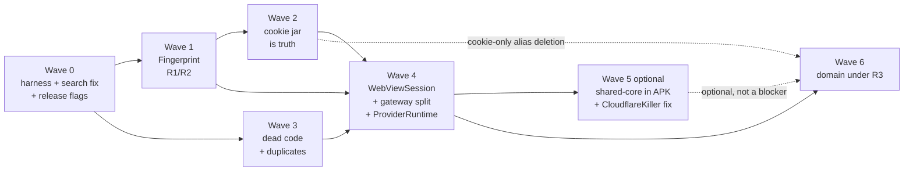
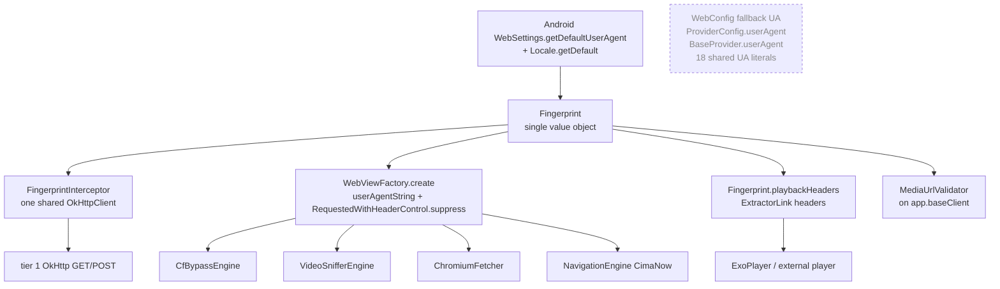

# `shared/` refactor waves

Date: 2026-09-03. Baseline HEAD `50df2f90`. This document replaces section 10 of
[shared-architecture-review.md](shared-architecture-review.md).

Where the two review docs disagree, this document follows
[shared-architecture-review-third-eye.md](shared-architecture-review-third-eye.md) and the owner
decisions below; the older doc's P1 `DomainUtils`, its `SessionState`-as-cookie-truth line, and its
"validate with the same rules as `isValidProviderDomain`" line are all superseded.

## Owner decisions (binding)

| # | Decision |
|---|---|
| D1 | Android `CookieManager` is the single cookie jar. OkHttp reaches it through a `CookieJar` adapter. `SessionStore`, `CookieLifecycleManager`, `SessionState.cookies`, `updateCookies`, `snapshotSession`, `restoreSession` are deleted. |
| D2 | No name-based domain logic. `DomainManager.isValidProviderDomain` denylist, aliases, `areDomainsRelated`, `MULTI_PART_TLDS`, registrable-suffix code, `ProviderConfig.trustedDomains` and every `allowedDomains` parameter are deleted. Adoption is behavioural; rewriting is history-based. |
| D3 | One `Fingerprint`, one OkHttp interceptor, one WebView factory. No UA literal anywhere in `shared/` or in provider modules that make browser-shaped requests. |

## Wave order

The owner reordered the domain work to last, so that behavioural domain adoption lands on top of an
already-split gateway rather than inside the god object. Where an earlier wave genuinely cannot
compile without a domain change, the minimal change is pulled forward and recorded in the leak table
in Wave 6.



Waves 0, 1, 2, 3, 4, 6 are each independently mergeable. Wave 5 is a discussion item.

## Fingerprint flow (target, established in Wave 1)



---

## Wave 0: test harness, search regression, release-risk flags

**Goal.** Get a JVM test suite that runs on every push, un-break the 22 providers whose custom search
is dead, and stop shipping diagnostics to users. No design change.

### Test harness: what works today

Verified by running it. `FaselHDV2Provider/build.gradle.kts:9-12` adds `../shared/src/test/kotlin` to
the module's `test` source set, and `:15-19` adds `junit:junit:4.13.2`. The runnable task is
`:FaselHDV2Provider:testDebugUnitTest`.

| Fact | Evidence |
|---|---|
| 18 tests, 4 classes, 0 failures | `FaselHDV2Provider/build/test-results/testDebugUnitTest/*.xml` after the run below |
| Classes | `VideoUrlClassifierTest` (6), `SnifferSelectorTest` (6), `Ipv6PinnedUrlTest` (4), `FaselHDExtractorTest` (2) |
| Tests live in the provider, not in shared | all four files are under `FaselHDV2Provider/src/test/kotlin/com/cloudstream/shared/...` |
| `shared/src/test` contributes nothing | its only file, `shared/src/test/kotlin/com/cloudstream/shared/extractors/FaselHDExtractorTest.kt:3-16`, is entirely inside a block comment |
| `--offline` does not work | `generateDebugUnitTestStubRFile` fails: no cached `lifecycle-process-2.4.1.aar` / `tracing-1.0.0.aar` |
| Robolectric | not on any classpath; do not assume it |

**Simplest option, and the recommendation: keep `FaselHDV2Provider` as the shared test host.** It
already compiles all of `shared/src/main` (`FaselHDV2Provider/build.gradle.kts:6-8`), already has
JUnit, and already passes. Adding a test costs one file.

A dedicated `SharedTests` module is worse for a concrete reason: `settings.gradle.kts:8-11` includes
every directory containing a `build.gradle.kts`, and `build.gradle.kts:36-39` applies
`com.android.library` plus `com.lagradost.cloudstream3.gradle` to every subproject. A new module
would be built and published as a plugin unless its name is added to the `disabled` list at
`settings.gradle.kts:6`, and a disabled directory is not included at all, so it could not host tests
either. Getting a real test module would mean restructuring the root build. Not worth it now.

Consequence for every wave below: **a unit test is a file under
`FaselHDV2Provider/src/test/kotlin/com/cloudstream/shared/<pkg>/`, plain JUnit 4, no Android
classes on the test path.** Anything Android-dependent needs a pure seam, spelled out per wave.

### Scope

| Action | File | Why |
|---|---|---|
| change | `shared/.../provider/BaseProvider.kt:166,206-247,257` | delete the pageless `open searchNormal(query)` / `searchLazy(query)`; the 22 overrides then fail to compile and get migrated to `(query, page)` |
| change | 22 provider files incl. `FaselHDV2Provider/.../FaselHDV2.kt:114-165`, `CimaNowProviderV2/.../CimaNowProvider.kt:822` | migrate each override to the paged signature; `page > 1` returns empty where the site has no paging |
| change | `shared/.../webview/NavigationEngine.kt:4175` | `ENABLE_WEBVIEW_REMOTE_DEBUGGING = true` verified; set to `false` |
| delete | `shared/.../webview/NavigationEngine.kt:4234` and its caller near `:2408` | `HEADER_ECHO_URL = "https://postman-echo.com/get"` sends the full header set to a third party |
| change | `NavigationEngine.kt:516-533,1012-1040,1062-1082,2237-2249`, `BaseProvider.kt:480-493` | one `DEBUG_DUMPS` flag, default false, gating every `cacheDir`/`externalCacheDir` write |
| change | `configs/domain-sync-worker/index.js:19-32` | delete the debug `GET`; it returns `tokenLength`, `tokenPrefix`, owner and repo |
| change | `configs/domain-sync-worker/index.js:41-48` | require a shared-secret header; reject `configFile` not in the known set (see note) |
| add | `.github/workflows/*` | run `:FaselHDV2Provider:testDebugUnitTest` and `shared/tools/check-injected-js.js` |

Worker note, verified: the POST body field is `configFile`, interpolated at
`configs/domain-sync-worker/index.js:64` as `configs/${configFile}`. That is a **file name, one per
provider**, not a domain, and there are 22 files in `configs/`. So the allowlist the owner asked
about is checkable and stays: `configFile` must be one of the 22 known names. It also closes a path
traversal, since `configFile` is unvalidated today. No domain validation is added here.

**Fingerprint invariant.** None established. This wave must not add a new UA literal or a new header
block.

**Behaviour rules touched.** None. R3 is untouched: the denylist at `DomainManager.kt:156-176` stays
until Wave 6.

**Acceptance criteria.**

1. `./gradlew :FaselHDV2Provider:testDebugUnitTest` passes in CI on every push.
2. `grep -rn "postman-echo\|ENABLE_WEBVIEW_REMOTE_DEBUGGING = true" shared/` returns nothing.
3. `grep -rn "open fun searchNormal(query: String)\b" shared/` returns nothing, and all 41 modules compile.
4. Searching a provider that has a custom search path returns its results, and page 2 differs from page 1.
5. A POST to the worker with an unknown `configFile` returns 400 and commits nothing; when `SYNC_SECRET` is set on the Worker, a missing or wrong `X-Sync-Secret` returns 401.

**Unit tests.**

| Class | Method | Asserts |
|---|---|---|
| `SearchPagingTest` | `pagelessOverloadIsGone` | reflection over `BaseProvider::class.java.methods` finds no one-arg `searchNormal`/`searchLazy` |
| `SearchPagingTest` | `pageTwoUsesPaginationFormat` | a fake `ParserInterface` with `paginationFormat` yields a page-2 URL distinct from page 1 |
| `DebugFlagsTest` | `dumpsDisabledByDefault` | the `DEBUG_DUMPS` constant is `false` |

**Manual verification.** In `log3.txt` after a search on FaselHD: the AJAX fallback log line from
`FaselHDV2.kt` appears (it cannot today). No line containing `postman-echo`. No
`setWebContentsDebuggingEnabled` line. `adb shell ls /sdcard/Android/data/<pkg>/cache` is empty after
a failed load.

**Risk and rollback.** Search migration is the only real risk: 22 files, each needing a judgement on
paging. It is compile-guided, so nothing fails silently. Rollback is per-file. The review estimates a
week for this item alone, not a day.

**Size: L** (search migration dominates; the flags are S).

---

## Wave 1: one `Fingerprint` (R1, R2)

**Goal.** One identity object built from the device, consumed by every browser-shaped request on
every tier, so OkHttp, all four WebViews, and the player present the same HTTP-layer identity.

### Scope

| Action | File | Why |
|---|---|---|
| add | `shared/.../core/Fingerprint.kt` | the single value object; see the design note below |
| add | `shared/.../core/FingerprintInterceptor.kt` | one OkHttp `Interceptor` on one shared client |
| add | `shared/.../webview/WebViewFactory.kt` | `create(activity, fingerprint)`: sets `userAgentString` and calls `RequestedWithHeaderControl.suppress` |
| delete | `shared/.../util/WebConfig.kt` | `FALLBACK_USER_AGENT` at `:23-24` is a literal Pixel 7 / Chrome 131 handed out whenever `getCachedUserAgent()` runs before any `Context` exists (`:60-64`); `buildSecChUa :78-81` is the second of three brand spellings |
| delete | `SessionState.buildHeaders` (`session/SessionState.kt:78-98`), `ProviderHttpService.kt:839-856`, `:382-386`, `strategy/StrategyTypes.kt:34-57` | four copies of one header block |
| delete | `ProviderConfig.userAgent` (`provider/ProviderConfig.kt:20`), `BaseProvider.userAgent` (`provider/BaseProvider.kt:56`) | R1 leaves no room for a per-provider browser UA |
| change | 18 UA literal sites under `shared/` | verified by `grep -rn "Mozilla/5.0" shared/src/main/kotlin` = 18 hits across `DrmPlayerDialog`, `WebConfig`, `WebViewFlowHelper`, `Savefiles`, `ArabHd`, `Estream`, `VKVideoEmbed` (3), `FaselHD`, `EarnVids`, `Odnoklassniki` (2), `Vertyuz`, `Laroza`, `AlbaPlayer`, `Cswru`, `OkPrime` |
| change | 13 provider-module files | verified by grep: `Topcinema`, `Anim3rb`, `Cimalight`, `Tuniflix`, `CimaLeek`, `Witanime`, `Shahid4u`, `Krmzy`, `eseek`, plus 4 `ExternalEarnVidsExtractor` copies. The 3 API-client files (`YoutubeProvider/innertube/*`, `Viu`) are out of scope per third-eye open question 2 and must carry an explicit `// API client, not a browser request` comment |
| change | `network/ChromiumFetcher.kt:160` | `extraHeaders["X-Requested-With"] = ""` is the value `RequestedWithHeaderControl.kt:110-126` documents as the detectable mistake; delete it and let the factory's `suppress` do the job |
| change | `network/MediaUrlValidator.kt:114-120,168-171` | drop its private `OkHttpClient`, use `app.baseClient` and `Fingerprint.playbackHeaders` |
| change | `extractors/SnifferExtractor.kt:389-400`, `extractors/AlbaPlayerExtractor.kt:212` | playback headers come from `Fingerprint.playbackHeaders` |

**Brand spelling.** Three disagree: `WebConfig.buildSecChUa:78-81` emits `"Not_A Brand";v="8",
"Chromium", "Google Chrome"`; `RequestedWithHeaderControl.chromeBrandMetadata:157-170` emits
`Not;A=Brand` / `Chromium` / `Google Chrome`; `NavigationEngine` emits a third. Follow
`RequestedWithHeaderControl`, because that is the value the WebView actually puts on the wire.

**Fingerprint invariant established.** Every browser-shaped request, on every tier, carries the same
`User-Agent`, the same `sec-ch-ua` triple, the same `Accept-Language`, and one `X-Requested-With`
policy. No literal UA compiles.

**Behaviour rules touched.** R1 and R2 in full. R3 untouched.

**Acceptance criteria.**

1. `grep -rn "Mozilla/5.0" shared/src/main/kotlin` returns 0 hits.
2. `grep -rn "Mozilla/5.0" --include=*.kt` outside `shared/` returns only the API-client files, each with the marker comment.
3. `Fingerprint` is constructed exactly once per process; no code path substitutes a fallback UA. If WebView is unavailable, construction throws with a named error.
4. `RequestedWithHeaderControl.headersControlledGlobally` is read after each of the four WebView creations, and a single log line reports it.
5. All four tiers show identical `user-agent` and `sec-ch-ua` in a captured request set.

**Unit tests.** Android seam: `Fingerprint.fromUserAgent(ua: String, locale: Locale): Fingerprint` is
pure; only its caller touches `WebSettings`. All tests below are JVM-pure.

| Class | Method | Asserts |
|---|---|---|
| `FingerprintTest` | `stripsWebViewMarker` | `fromUserAgent("...; wv) ... Chrome/150.0.7100.5 Mobile Safari/537.36", US)` has no `; wv)` |
| `FingerprintTest` | `forcesMobileToken` | a desktop-shaped input yields a UA containing `Mobile Safari` |
| `FingerprintTest` | `parsesFullChromeVersion` | `chromeFullVersion == "150.0.7100.5"`, `chromeMajor == "150"` |
| `FingerprintTest` | `brandListHasOneSpelling` | `secChUa == "\"Not;A=Brand\";v=\"8\", \"Chromium\";v=\"150\", \"Google Chrome\";v=\"150\""` |
| `FingerprintTest` | `acceptLanguageFromLocale` | `Locale("ar","EG")` yields `ar-EG,ar;q=0.9`; `Locale.US` yields `en-US,en;q=0.9` |
| `FingerprintTest` | `missingChromeVersionThrows` | a UA with no `Chrome/` token throws rather than defaulting to `131` |
| `FingerprintInterceptorTest` | `documentRequestHeaders` | given a request tagged as a document, the produced header map equals the exact expected set, key by key, including `sec-fetch-*` |
| `FingerprintInterceptorTest` | `callerUaIsNotOverwritten` | a request that already sets `User-Agent` keeps it, and the hint headers are then omitted (preserves the documented behaviour at `ProviderHttpService.kt:366-379`) |
| `FingerprintInterceptorTest` | `hintNamesAreLowerCase` | one casing everywhere, closing the Title-Case vs lower-case split between the OkHttp path and `SnifferExtractor.kt:389-400` |
| `PlaybackHeadersTest` | `containsUaRefererOriginAndCookie` | `playbackHeaders(referer, origin, cookieHeader)` produces exactly those keys plus `Accept: */*` |
| `PlaybackHeadersTest` | `omitsCookieWhenEmpty` | no empty `Cookie` header is emitted |

**Manual verification.** Point all four tiers at one local echo endpoint on device and diff the
header sets; they must match on `user-agent`, `sec-ch-ua`, `sec-ch-ua-mobile`, `sec-ch-ua-platform`,
`accept-language`. In `log3.txt`, no line contains `Pixel 7` or `Chrome/131` unless the device really
is one. The `X-Requested-With disabled for ALL origins` line
(`NavigationEngine.kt:1192`) must now appear for the sniffer and CF-solve WebViews too, not only for
`NavigationEngine`.

**Risk and rollback.** Medium. Sites currently succeed against a Windows Chrome 120 UA from
`LarozaExtractor.kt` and against an Android WebView brand string from the CF-solve WebView; both
change. Rollback is per-consumer: the interceptor and the factory can be reverted independently, and
the `Fingerprint` object can stay. `OdnoklassnikiApiExtractor` requires a Chrome-family UA per its own
note; the device UA is Chrome, so it qualifies.

**Size: M.**

---

## Wave 2: the system cookie jar is the only cookie store

**Goal.** Delete three of the four cookie stores. OkHttp and every WebView read and write
`android.webkit.CookieManager`, and cookie scope is whatever the `Set-Cookie` header said.

### Scope

| Action | File | Why |
|---|---|---|
| add | `shared/.../core/SystemCookieJar.kt` | `loadForRequest` = `CookieManager.getInstance().getCookie(url)`, `saveFromResponse` = `setCookie(url, header)`; installed on the one shared client |
| delete | `shared/.../session/SessionStore.kt` | prefs `session_<name>`; superseded. Also fixes the bug where `load` returns null on empty cookies and so discards domain and UA (`:78-81`) |
| delete | `shared/.../cookie/CookieLifecycleManager.kt` | written by 2 sites, read by 0 |
| change | `shared/.../session/SessionState.kt` | drop `cookies`, `cookieTimestamp`, `fromWebView`; what remains is domain plus UA, and UA leaves in Wave 1, so the type becomes a candidate for deletion in Wave 4 |
| delete | `ProviderHttpService.updateCookies` (`:117-145`), `snapshotSession`/`restoreSession` (`:147-185`), `syncCookiesToSystemCookieManager` | hand-written four-way sync |
| delete | `session/SessionProvider.getCookiesForDomain` (`:136-160`) | **cookie-only code**: it is a cookie lookup that happens to consult the alias set. Deleting it is safe here. The alias machinery itself (`extractBaseDomain :44`, `MULTI_PART_TLDS :72`, `areDomainsRelated :86`, `addDomainAlias :105`) stays until Wave 6 |
| change | `ProviderHttpService.kt:1061-1063` | the `ProviderConfig.trustedDomains` `contains` test gates `Set-Cookie` ingestion. Ingestion becomes the jar's job. Remove the call site; leave the `trustedDomains` field declared and unused until Wave 6 so this wave stays cookie-only |
| change | `ProviderHttpService.kt:1106-1109` | re-solve invalidation expires the current host's cookies only, by setting each name with `Max-Age=0` for that URL. Never `removeAllCookies` |

### Multi-host scenarios (why aliases become unnecessary)

Today provider cookies are a flat `Map<String,String>` in `SessionState` with no host scoping. So
`SessionProvider.getCookiesForDomain` (`SessionProvider.kt:136-160`) has to decide by name similarity
(`areDomainsRelated`, the alias set) whether to attach them to a foreign host. Aliases are a manual
reimplementation of cookie-jar scoping. With `CookieManager` as the only store, scope is whatever
`Set-Cookie` said.

| Scenario | Today (alias code) | After Wave 2 (jar) |
|---|---|---|
| Main page on `www.faselhd.center`, watch link on `faselhd.center` | alias added if "related"; cookies attached by hand | Cloudflare sets `cf_clearance` with `Domain=.faselhd.center`; the jar sends it to both hosts. Nothing to configure |
| Episode links on `w312x.faselhdx.xyz` while current is `w318x.faselhdx.xyz` | same alias path | same: subdomains under one registrable domain share the apex cookie |
| Watch link on `faselhds.shop` (different registrable domain) | not "related": cookies refused, or wrong cookies sent | different CF zone, so `.faselhd.center` cookies were never valid there. The request goes without cookies, is challenged, the normal CF solve runs on that host, the jar stores `.faselhds.shop` cookies, later requests work |
| Third-party CDN or embed host | not related: no cookies | the jar sends only cookies that host set itself |
| Player headers for a captured stream | `SnifferExtractor.kt:359-373` merges system jar plus `SessionProvider.getCookies()` | one `CookieManager.getCookie(url)` read at link creation; the player carries the same cookies as the request that produced the page |

This assumes `cf_clearance` carries a parent `Domain` attribute. That is standard Cloudflare
behaviour, but it is unverified in this repo; see Manual verification below. If a site sets host-only
cookies, the sibling host is challenged and solved separately. That still works, but it costs one
extra solve.

**Explicit non-touch.** This wave must not change `DomainManager`, must not delete
`areDomainsRelated`/`addDomainAlias`/`extractBaseDomain`/`MULTI_PART_TLDS`, and must not remove any
`allowedDomains` parameter. Those are Wave 6.

**Fingerprint invariant preserved.** Cookies now come from one place, so the merged-cookie logic at
`SnifferExtractor.kt:359-373` (system jar plus `SessionProvider.getCookies()`) collapses to one read,
and playback headers stop carrying a different cookie set than the request that produced the page.

**Behaviour rules touched.** D1 in full. R3 only via the `getCookiesForDomain` deletion above.

**Acceptance criteria.**

1. `grep -rn "CookieLifecycleManager\|SessionStore\|updateCookies\|restoreSession" shared/` returns nothing.
2. `SessionState` has no `cookies` field.
3. After a CF solve, an OkHttp request to the same host sends `cf_clearance` with no explicit cookie plumbing in provider code.
4. A re-solve clears cookies for the solved host only; cookies for an unrelated provider host survive.
5. No code path calls `CookieManager.removeAllCookies`.

**Unit tests.** Android seam: the jar adapter's mapping is pure if the `CookieManager` calls sit
behind a two-method `CookieStorage` interface (`get(url): String?`, `set(url, header)`).

| Class | Method | Asserts |
|---|---|---|
| `SystemCookieJarTest` | `loadForRequestParsesHeaderString` | `"a=1; b=2"` from a fake `CookieStorage` becomes two `Cookie` objects with the right names and values |
| `SystemCookieJarTest` | `loadForRequestOnEmptyReturnsEmptyList` | null and blank both give an empty list, no exception |
| `SystemCookieJarTest` | `saveFromResponseWritesEachSetCookieVerbatim` | each `Set-Cookie` line is passed to `set` unmodified, attributes included |
| `SystemCookieJarTest` | `noHostRewritingOnSave` | the URL handed to `set` is the response URL, not a rewritten one |
| `CookieInvalidationTest` | `expiresOnlyNamedCookiesForOneUrl` | given `a=1; b=2` for host X, invalidation issues exactly `a=; Max-Age=0` and `b=; Max-Age=0` for X and nothing for host Y |

**Manual verification.** On device: solve CF on provider A, then load provider B; B's session must
survive. In `log3.txt`, the four-way `updateCookies` log lines disappear and are replaced by one jar
write per response. Verify the FaselHD sibling-host case
(`ProviderHttpService.kt:218-221`, `w312x` vs `w318x`): if `cf_clearance` carries a parent `Domain`
attribute the sibling still works; if the site sets host-only cookies it will not, and the fix is a
provider-level hook, not a global heuristic.

**Risk and rollback.** Medium, and the sibling-host case above is the specific thing to test before
merging. The app's `CloudflareKiller` calls
`CookieManager.getInstance().removeAllCookies(null)` in its `init` block, at
`../app/src/main/java/com/lagradost/cloudstream3/network/CloudflareKiller.kt:37`. Once providers
depend on the jar, constructing a `CloudflareKiller` anywhere wipes every provider session. Either
land the app-side fix (Wave 5) first, or confirm no code path in this fork constructs one during a
provider flow. Rollback: revert the jar adapter; the deleted stores would have to come back with it,
so keep this wave as one commit.

**Size: M.**

---

## Wave 3: delete dead code and duplicates

**Goal.** Remove what is dexed 41 times and referenced zero times. Purely subtractive, compile-guided.

### Scope: files to delete

| File | LOC |
|---|---:|
| `webview/WebViewFlowHelper.kt` | 683 |
| `session/ProviderStateStore.kt` | 187 |
| `strategy/DirectHttpStrategy.kt` | 162 |
| `extractors/JWPlayerExtractor.kt` | 128 |
| `parsing/BaseParser.kt` | 111 |
| `strategy/StrategyTypes.kt` (keep `VideoSource`) | 109 |
| `extractors/EvalDeobfuscator.kt` | 108 |
| `extractors/PackerUnpacker.kt` | 96 |
| `extractors/LinkResolvers.kt` | 45 |
| `extractors/RefererRotator.kt` | 43 |
| `com/lagradost/cloudstream3/utils/LazyExtractorLink.kt` | 16 |
| `parsing/GenericParser.kt` + `parsing/ParserSpec.kt` | 467 |
| `extractors/LazyExtractor.kt` | 542 |
| **Total (actual deleted lines, `git diff HEAD --numstat`, excluding `log3.txt` and `docs/`)** | **4,129** |

**Correction (post-review).** `webview/WebViewTypes.kt` and `ui/TvMouseComponents.kt` were listed here
as dead and have been struck from the table: they are live — `TvMouseController` is used by all three
WebView engines and every type in `WebViewTypes.kt` is referenced.

Dead members to delete in the same wave, all listed in
[shared-architecture-review.md](shared-architecture-review.md) section 7a:
`ProviderHttpService.getMainPage/search/getPlayerUrls` (`:245-267`, the only users of the injected
`parser`), `sniffVideosVisible`, `navigateWithSteps`, `validateMediaUrls`, `isMediaAccessible`,
`storeCdnCookies` (already removed in Wave 2), `CloudflareDetector.isSuccessfulLoad`,
`ProviderLogger.logSessionState` / `logRequestStart` / `logRequestComplete`,
`SessionSnapshot` (already removed in Wave 2), `SessionState.withDomain` (live, kept),
`ProviderConfig.cookieMaxAgeMs` / `validateWithContent` / `videoSniffTimeoutMs`,
`ProviderHttpService.kt:735` `if (false /* disabled */)`, `ByseExtractor.tryWebViewExtraction :448`,
`SnifferSelector.waitAfterClick` (live, kept).

Duplicates to collapse: the 4 `ExternalEarnVidsExtractor` copies (`Animerco`, `Lodynet`,
`Replaymatch`, `Shahid4u`) onto shared's `EarnVidsExtractor`; Witanime's `Videa` and `Mailru` shadows;
YoutubeProvider's own `CloudflareDetector`; the 3 copies of `parseCookieString`
(`NavigationEngine :3944`, `VideoSnifferEngine :1995`, `CfBypassEngine :559`) onto one; the 4 copies of
the DisableDevtool spoof JS; the 5 copies of `fixUrl`. Do **not** collapse the 5 copies of domain
string parsing here; that is Wave 6.

**Fingerprint invariant preserved.** Three of the deleted files carried UA literals
(`WebViewFlowHelper`, `StrategyTypes`'s header block, `EvalDeobfuscator`'s companions), so this wave
must run after Wave 1 or it will re-introduce a literal during the merge.

**Behaviour rules touched.** None. Domain code is explicitly out of scope.

**Acceptance criteria.**

1. All 41 modules compile with no source change other than deletions and import fixes.
2. `:FaselHDV2Provider:testDebugUnitTest` still passes (18 tests plus whatever Waves 0 to 2 added).
3. A rebuilt thin plugin's `classes.dex` is measurably smaller; record `MyCimaProvider.cs3` before and after against the 1,523,388 byte baseline.
4. The four `ExternalEarnVidsExtractor` copies are deleted and their callers use shared
   `EarnVidsExtractor.extractDirect`.

**Unit tests.** Deletion needs no new tests, but the collapses do.

| Class | Method | Asserts |
|---|---|---|
| `CookieStringParserTest` | `parsesNameValuePairs` | `"a=1; b=2; c="` yields `a=1`, `b=2`, and **keeps** the empty value (`c=` -> key `c` with `""`), matching the surviving implementation and all four originals |
| `CookieStringParserTest` | `handlesValueContainingEquals` | `"jwt=aa=bb"` keeps `aa=bb` as the value |
| `FixUrlTest` | `resolvesProtocolRelative` | `//cdn.x/y` against `https://a.b` becomes `https://cdn.x/y` |
| `FixUrlTest` | `resolvesRootRelativeAndAbsolute` | `/y` becomes `https://a.b/y`; an absolute URL is returned unchanged |
| `EarnVidsUnificationTest` | `sharedExtractorHandlesAllFourHostSets` | the union of the four deleted copies' `mainUrl` values is accepted by the surviving extractor |

**Manual verification.** Load links on Animerco, Lodynet, Replaymatch and Shahid4u; each must still
resolve at least one server. Check plugin size on the `builds` branch.

**Risk and rollback.** Low for the pure deletions, medium for the 4 EarnVids copies, which are
byte-identical apart from their package line and CRLF endings (Animerco additionally carries one
unused import). Diff them first and keep the union of behaviour. Rollback per file.

**Size: M.**

### Result

- `MyCimaProvider.cs3`: 657,385 -> 586,889 bytes.
- `classes.dex`: 1,687,368 -> 1,495,100 bytes.
- 83 unit tests passing (`:FaselHDV2Provider:testDebugUnitTest`), 78 pre-existing plus the five in
  the new `EarnVidsStrategyOrderTest`.
- 4,129 lines deleted, 198 added (`git diff HEAD --numstat`, excluding `log3.txt` and `docs/`).

---

## Wave 4: `WebViewSession` base, gateway split, `ProviderRuntime`

**Status (2026-10-02).** 4a, 4b-1, 4b-2 and 4b-3 are on `main`; 4c is on PR #1, still unreviewed. See
[shared-refactor-progress.md](shared-refactor-progress.md) section 11 for what is left.

**Goal.** Break the two god objects. One WebView session base, one HTTP gateway, one provider-facing
interface, extractors injected by constructor, `NavigationEngine` moved into its only consumer.

Order inside the wave matters: `WebViewSession` first, because tiers 2 and 3 depend on it, then the
`ProviderHttpService` split.

### Scope

| Action | File | Why |
|---|---|---|
| add | `shared/.../webview/WebViewSession.kt` | creation via `WebViewFactory`, a `CoroutineScope` tied to the session, a `Mutex`, a `@Volatile` delivery flag, the intercept hook, HTML and cookie extraction, cleanup |
| change | `webview/CfBypassEngine.kt`, `webview/VideoSnifferEngine.kt`, `network/ChromiumFetcher.kt` | become subclasses; they lose their own `parseCookieString`, `cleanup`, spoof JS, and non-volatile flags |
| add | `shared/.../core/ProviderRuntime.kt` | the 8-method interface from third-eye section 4. Keep it at 8 or shrink it; do not grow it |
| add | `shared/.../core/HttpGateway.kt` | `RequestQueue`, the three tiers, a sealed `FetchOutcome` replacing the four string-matched error literals (`RequestQueue.kt:154,230`, `ProviderHttpService.kt:1137`, matched at `:690-709`) |
| delete | `shared/.../service/ProviderHttpService.kt` (1,406 LOC) | absorbed by `HttpGateway`, `WebViewSession` subclasses, and `Fingerprint` |
| delete | `shared/.../service/ProviderHttpServiceHolder.kt` | replaced by constructor injection into the 10 Holder-using extractors |
| change | `extractors/*` (10 files incl. `LarozaExtractor.kt:32`, `VKVideoEmbed.kt:33`, `ByseExtractor.kt:344`) | take `Fingerprint` and the jar by constructor. `ExtractorApi.getUrl` has a fixed signature, so a per-call context is not possible; constructor injection is the only option |
| change | `registerSharedExtractors` | becomes a per-plugin list of constructed instances, fixing the 40-copies-in-`extractorApis` problem and the built-in name collisions (`MailruExtractor.kt:15-16` vs the app's `MailRu`, `OdnoklassnikiApiExtractor.kt:15` on `ok.ru`) |
| move | `webview/NavigationEngine.kt` (4,410 LOC), `webview/VideoSnifferJs.kt` cimanow parts, `extractors/CimaNowTVEmbed.kt`, `NavigateToWatchingUrl` | into `CimaNowProviderV2`. Single consumer: `CimaNowProvider.kt:1336,2435,3129` |
| change | `parsing/` | one base; `BaseParser` (renamed from `NewBaseParser` in Wave 4b-3); `BaseProvider.getParser()` typed as `ParserInterface` (`BaseProvider.kt:78`) |
| change | `queue/RequestQueue.kt` | decouple the injected callbacks (`ProviderHttpService.kt:66-75`) that create the cycle |

**Explicit non-touch.** `RequestQueue.allowedDomains` (`:112-121`) and its callers keep their current
signatures. `DomainManager` keeps its denylist and its current adoption call sites. If the split
genuinely cannot compile without touching them, record it in the Wave 6 leak table.

**Fingerprint invariant preserved.** All three WebView subclasses now get their UA and their
`X-Requested-With` policy from one factory call in the base class, which makes the Wave 1 invariant
structural rather than a convention.

**Behaviour rules touched.** R4. R3 untouched by design.

**Acceptance criteria.**

1. `ProviderRuntime` has at most 8 methods, and a thin provider compiles against it alone.
2. No file in `shared/` references `cimanow` or `freex`. `grep -rn "cimanow\|freex" shared/` returns 0.
3. `ProviderHttpServiceHolder` is gone; no extractor resolves a global.
4. `FetchOutcome` is a sealed type; no error decision matches a message string.
5. Concurrent `runSession` calls on one engine serialise; `resultDelivered` is `@Volatile`.
6. MyCima still works unchanged as the thin-provider proof.

**Unit tests.** Seam: `HttpGateway`'s decision logic is pure if `FetchOutcome` classification takes
`(code: Int, body: String, finalUrl: String)`.

| Class | Method | Asserts |
|---|---|---|
| `FetchOutcomeTest` | `cfChallengeIsBlocked` | a 403 with a CF challenge body maps to `FetchOutcome.CloudflareBlocked` |
| `FetchOutcomeTest` | `plainCfClearanceCookieIsNotBlocked` | a 200 body merely containing `cf_clearance` is `Success`, closing the false positive at `CloudflareDetector.kt:16,21` |
| `FetchOutcomeTest` | `responseCodeIsActuallyUsed` | a 200 and a 503 with the same body classify differently, closing the ignored parameter at `CloudflareDetector.kt:49` |
| `FetchOutcomeTest` | `noStringMatchingOnErrorMessages` | classification of two outcomes with identical human-readable messages but different codes differs |
| `ProviderRuntimeSurfaceTest` | `hasAtMostEightMethods` | reflection on `ProviderRuntime::class.java.methods` |
| `RequestQueueTest` | `secondCallerForSameHostParks` | with a fake executor, two concurrent calls for one host produce one execution |
| `RequestQueueTest` | `followersRunAfterLeaderSuccess` | followers execute exactly once each |

**Manual verification.** CimaNow's full freex flow still mints a watching URL (see the
`cimanow-freex-getlink-http` note). One CF-solve at a time per provider under a burst of parallel
searches. In `log3.txt`, one session-scoped cancel line per WebView teardown instead of the current
partial cleanup.

**Risk and rollback.** High. This is the largest wave and it touches the paths every provider uses.
Split it into at least three commits: `WebViewSession` base, then the gateway split, then
`NavigationEngine`'s move. Each is separately revertable. Do not merge it in the same release as
Wave 6.

**Size: L.**

---

## Wave 5 (optional, for discussion): `shared-core` into the APK

**Goal.** One copy of the core on the device instead of 41, real unit tests in the app module, and
singletons with correct cardinality. Only sensible after Wave 4, which fixes the cardinality bugs
that would otherwise become live the moment there is one classloader.

### Scope

| Action | Item | Why |
|---|---|---|
| move | `shared/core`, `shared/webview` base | into the APK; exposed to plugins as `compileOnly` |
| keep | site extractors, site-specific WebView flows, parsers | in plugins; a core fix should not need an APK release for these |
| add | `requiresCoreApi` in the plugin manifest; `BaseProvider` refuses to load on mismatch with a visible message | plugins update from the `builds` branch independently of app releases (`docs/README.md:11-13`), so skew is certain |
| change | `../app/.../network/CloudflareKiller.kt:37` | `CookieManager.getInstance().removeAllCookies(null)` runs in the class's `init` block (`:33-39`), wiping every provider session whenever a `CloudflareKiller` is constructed. Scope it to the URL being solved, or drop it |
| verify | R8 keep rules | if the app build minifies, the boundary-interface reflection in `RequestedWithHeaderControl` (`:254-262`) and the app-side reflection in `LazySearchConfig.kt:21-39` need keep rules |

**Fingerprint invariant preserved.** `Fingerprint` becomes genuinely process-wide instead of
per-classloader, which is the state Wave 1 was written against.

**Behaviour rules touched.** R4 only.

**Acceptance criteria.** A thin plugin drops below 100 KB. An older plugin built against an earlier
core API refuses to load with a readable message rather than a `NoSuchMethodError`. `shared` tests run
as a normal app-module test task.

**Unit tests.** `CoreApiVersionTest.rejectsNewerRequiredApi`, `CoreApiVersionTest.acceptsEqualOrOlder`,
`CoreApiVersionTest.messageNamesThePlugin`.

**Manual verification.** Install the new APK with a deliberately stale plugin and confirm the message.
Confirm cookies survive a `CloudflareKiller` construction.

**Risk and rollback.** High operational risk, low code risk. Open question 6 in the third-eye doc
must be answered first: how many older plugin builds a new app must keep loading.

**Size: L.**

---

## Wave 6: domain handling under R3

**Status (2026-10-02).** Design done in [wave-6-design.md](wave-6-design.md); five owner questions open
before 6-1.

**Goal.** Delete every name-based domain decision. Replace it with behaviour-based adoption, a
persisted host history for rewriting, and a two-success rule for remote sync. Last wave by owner
decision, so it lands on a split gateway rather than inside `ProviderHttpService`.

### Domain touches pulled forward into earlier waves

Everything in this table is a domain-adjacent change that an earlier wave could not avoid. Nothing
else in Waves 0 to 5 may touch domain logic.

| Wave | Touch | Why it could not wait | Residue left for this wave |
|---|---|---|---|
| 0 | worker `configFile` allowlist (`configs/domain-sync-worker/index.js:41-48,64`) | it is a provider file name, not a domain, and it is the fix for an unvalidated path interpolation | none; the rule survives Wave 6 unchanged |
| 2 | delete `SessionProvider.getCookiesForDomain` (`:136-160`) | it is a cookie read path and D1 removes the store it reads from | the alias set it consulted stays declared and unused |
| 2 | remove the `ProviderConfig.trustedDomains` call site at `ProviderHttpService.kt:1061-1063` | it gates `Set-Cookie` ingestion, which becomes the jar's job | the `trustedDomains` field itself stays declared until here |
| 4 | possibly `RequestQueue.allowedDomains` (`:112-121`) if the gateway split cannot carry the parameter | to be confirmed during the split; if it happens, record the commit here | none |

### Scope

| Action | File | Why |
|---|---|---|
| delete | `session/SessionProvider.kt` entirely | `domainAliases :20-21`, `extractBaseDomain :44-69`, `MULTI_PART_TLDS :72-77`, `areDomainsRelated :86-99`, `addDomainAlias :105-130`. Callers to update: `ProviderHttpService :141,178,223,362,814,886,918`, `BaseProvider :410-417`, `SnifferExtractor :371`, `LazyExtractor :56,339`, `SavefilesExtractor :33`, `VKVideoEmbed :37-38`, `CimaNowProvider` |
| delete | `DomainManager.DENYLISTED_HOSTS :156-160` and `isValidProviderDomain :167-176` as a decision | verified present. A syntactic "is a hostname" check (non-blank, ASCII, contains a dot; `:168-170`) may survive, because it decides nothing about *which* site |
| delete | `ProviderConfig.trustedDomains :29` | the field, now that its only call site went in Wave 2 |
| delete | `RequestQueue.kt:112-121` `allowedDomains` and its `takeLast(2)`; `CfBypassEngine.kt:53,209` (whose miss branch allows the navigation anyway at `:216-217`, so the parameter never had an effect); `NavigationEngine.kt:210,2634-2641` | R3 forbids all of it |
| delete | `removePrefix("www.")` at `ProviderHttpService :1312` and `RequestQueue :291` | `www.x` and `x` are two hosts |
| delete | the 5 copies of domain string parsing | `ProviderHttpService.extractDomain :1312`, `RequestQueue.extractDomain :291`, `CookieLifecycleManager.normalizeKey :89` (already gone in Wave 2), `SessionProvider.extractBaseDomain :44`, `DomainManager :93-96` |
| add | `DomainManager.adopt(outcome: FetchOutcome, requestKind: RequestKind)` | the single adoption rule |
| add | `DomainManager.hostHistory` persisted ordered list | the rewrite rule |
| change | `checkAndUpdateDomain :1174`, `handleMetaRefreshRedirect :1199`, `RequestQueue :85,132`, `BaseProvider.handleDomainDifference :398` | all collapse into the one adoption call |
| change | `rewriteUrlIfNeeded :1147-1170`, `RequestQueue.rewriteFollowerUrl :281-288` | rewrite the host only if the URL's host is in the history and differs from the current domain; rewrite the host component, not a substring of the whole URL |
| change | `DomainManager.syncToRemote :96-121` | push only after the new host passed adoption twice and the old host redirected or hard-failed in the same session; run it in a structured scope, not the detached `CoroutineScope(Dispatchers.IO)` at `:121` |

### The three rules

| Fact | Owner | Rule |
|---|---|---|
| current domain | `DomainManager` (per provider) | adopt host H only when a **provider-initiated document request** ends 2xx and `FetchOutcome` is not `CloudflareBlocked`. H is the final URL host of the redirect chain, a meta-refresh target that passes the same test, or a CF solve's final URL that passes the same test. Extractor, image and intercepted-subresource requests never adopt |
| host history | `DomainManager` (persisted, ordered) | rewrite a URL's host to the current domain only if its host is already in the history |
| remote sync | `DomainManager` | push after the second adoption on the new host, with the old host observed failing in the same session |

This covers the observed poisoning without naming Cloudflare: the challenge redirect to
`cloudflare.com` documented in [search-architecture.md](search-architecture.md) root cause A arrives
as a CF-flagged response and so cannot be adopted. It covers the FaselHD proxy hop
(`RequestQueue.kt:104-107`) because the proxy response is blocked. If a site is later observed serving
a 2xx non-CF interstitial on a foreign host, add "the parser yields at least one item" to the test
then, not before.

### Multi-host scenarios (rewrite and adoption)

Under these rules "domain" means one thing: the host on which main page and search URLs are built.
Other hosts appearing in links are fetched as-is.

| Scenario | Today | After Wave 6 |
|---|---|---|
| Main page redirected `faselhd.center` to `faselhds.shop`, 2xx non-CF document | `checkAndUpdateDomain` adopts on any host change (`ProviderHttpService.kt:1174`) | adopted; `faselhd.center` enters host history |
| Cached or embedded links still on `faselhd.center` after the move | `rewriteUrlIfNeeded` substring replace (`ProviderHttpService.kt:1147-1170`) | rewritten to the current domain because the host is in history; host component only |
| Watch link on `faselhds.shop` while main is still `faselhd.center` | may be rewritten if judged related | fetched as-is, never rewritten. Never adopted either, unless it is itself a provider-initiated document request ending 2xx non-CF |
| Third-party CDN or embed host in a URL | substring replace can corrupt it | never rewritten, never adopted |
| CF challenge redirect to `cloudflare.com` | denylist (`DomainManager.kt:156-176`) | a CF-flagged outcome cannot be adopted; no names involved |
| Sibling host that was never the main domain and is now dead (e.g. stale `w312x` links) | name similarity may rewrite it to the current host | NOT rewritten. Known gap |

The last row is the one real regression. Two behaviour-based options exist, and neither is in scope
now. Add one only when a log shows the case. (a) Retry a failed provider-initiated request once on
the current domain when the failure is at DNS or connect level. (b) A parser-level hook that
normalises link hosts for that one site.

**Fingerprint invariant preserved.** Unaffected; no header changes here.

**Behaviour rules touched.** R3 in full, plus D2.

**Acceptance criteria.**

1. `grep -rn "areDomainsRelated\|domainAliases\|MULTI_PART_TLDS\|trustedDomains\|allowedDomains\|DENYLISTED_HOSTS" .` returns 0 hits outside this document.
2. A CF-flagged response never changes the persisted domain, verified by a unit test, not by a denylist.
3. A third-party host in a page URL is fetched as-is, never rewritten.
4. A previously-seen host is rewritten to the current domain.
5. One device observing one success does not sync to the worker; two do.
6. An install whose persisted domain is `cloudflare.com` today self-heals on the first successful document request, because the good host is adopted and the bad one is never re-adopted.

**Unit tests.** Seam: adoption and rewriting are pure over
`(currentDomain, history, outcome, requestKind)` and over `(url, history, currentDomain)`; only
persistence touches Android.

| Class | Method | Asserts |
|---|---|---|
| `DomainAdoptionTest` | `adoptsOn2xxDocumentRequest` | a `Success` document outcome on a new host changes the current domain and appends to history |
| `DomainAdoptionTest` | `doesNotAdoptOnCloudflareBlocked` | a CF-flagged outcome on `cloudflare.com` leaves the domain unchanged, with no denylist involved |
| `DomainAdoptionTest` | `doesNotAdoptOnNon2xx` | 403, 500 and a transport error all leave it unchanged |
| `DomainAdoptionTest` | `doesNotAdoptFromExtractorOrImageRequest` | same success outcome with `RequestKind.Extractor` or `RequestKind.Image` changes nothing |
| `DomainAdoptionTest` | `adoptsMetaRefreshTargetOnlyAfterItPasses` | the target host is adopted only when its own fetch is a clean 2xx |
| `HostHistoryRewriteTest` | `rewritesKnownOldHost` | a URL on a host in history is rewritten to the current domain |
| `HostHistoryRewriteTest` | `leavesThirdPartyHostAlone` | a CDN host absent from history is untouched |
| `HostHistoryRewriteTest` | `wwwIsADistinctHost` | `www.x.com` is not rewritten unless `www.x.com` is itself in history |
| `HostHistoryRewriteTest` | `rewritesHostComponentNotQueryString` | `https://old.x/p?u=https://old.x/q` rewrites only the first host, closing the substring bug at `ProviderHttpService :1158,1164` |
| `HostHistoryRewriteTest` | `preservesPortAndScheme` | rewriting keeps `:8443` and `http`/`https` |
| `RemoteSyncRuleTest` | `noSyncAfterOneSuccess` | one adoption produces no push |
| `RemoteSyncRuleTest` | `syncAfterSecondSuccessWithOldHostFailed` | two adoptions plus an observed old-host failure produce exactly one push |
| `RemoteSyncRuleTest` | `noSyncWhenOldHostNeverFailed` | two adoptions alone produce no push |

**Manual verification.** Take the `log3.txt` line 9 case (`urlDomain=cloudflare.com,
sessionDomain=cloudflare.com` on Cimawbas) as the regression: on an install poisoned that way, the
first successful document request must move the domain back and the log must show one adoption line
naming the real host. Watch for zero `[Auto] Update ... domain` commits from a single device in a
session. Confirm FaselHD episode links on an old sibling host still load, per the Wave 2
sibling-cookie caveat.

**Risk and rollback.** Medium. The deletions are compile-guided; the adoption rule is the behavioural
change. Ship it behind one flag that falls back to the old `checkAndUpdateDomain` for one release if
the owner wants a safety net, then delete the flag. Do not ship it in the same release as Wave 4.

**Size: M.**

---

## Wave 1 design note: the `Fingerprint` contract

Derived from the third-eye fingerprint inventory
([shared-architecture-review-third-eye.md](shared-architecture-review-third-eye.md) section 2). Row
citations below refer to that table.

```kotlin
data class Fingerprint(
    val userAgent: String,        // device UA, "; wv)" stripped, "Mobile" ensured
    val chromeFullVersion: String,// e.g. "150.0.7100.5"
    val chromeMajor: String,      // e.g. "150"
    val secChUa: String,          // one spelling, from RequestedWithHeaderControl:157-170
    val platform: String,         // "Android"
    val platformVersion: String,  // Build.VERSION.RELEASE + ".0.0"
    val model: String,            // Build.MODEL
    val acceptLanguage: String,   // from Locale.getDefault()
    val requestedWithValue: String // "com.android.chrome", RequestedWithHeaderControl:126
) {
    companion object {
        fun fromUserAgent(ua: String, locale: Locale, release: String, model: String): Fingerprint
    }
}
```

`fromUserAgent` is pure and is what the unit tests exercise. The Android-touching caller is one
function that reads `WebSettings.getDefaultUserAgent(appContext)`, `Locale.getDefault()`,
`Build.VERSION.RELEASE` and `Build.MODEL`. There is no fallback UA: if WebView is unavailable,
construction throws, replacing the Pixel 7 literal at `WebConfig.kt:23-24`.

### Which consumer sets which headers

| Consumer | Replaces inventory row | Headers it sets |
|---|---|---|
| `FingerprintInterceptor`, document request | rows for `ProviderHttpService :839-856` and `SessionState :78-98` | `user-agent`, `sec-ch-ua`, `sec-ch-ua-mobile: ?1`, `sec-ch-ua-platform: "Android"`, `accept: text/html,...`, `accept-language`, `accept-encoding`, `upgrade-insecure-requests: 1`, `sec-fetch-site`, `sec-fetch-mode: navigate`, `sec-fetch-dest: document`, `sec-fetch-user: ?1`. `sec-fetch-site` is computed from referer versus target, not hardcoded to `none`, which fixes the POST case at `SessionState.kt:89` |
| `FingerprintInterceptor`, subresource / raw | row for `ProviderHttpService :382-386` | `user-agent`, the three `sec-ch-ua*`, `accept: */*`, `accept-language`, `sec-fetch-mode: cors`, `sec-fetch-dest: empty`. Caller-supplied `User-Agent` still suppresses the hints, preserving the documented behaviour at `ProviderHttpService.kt:366-379` |
| `WebViewFactory.create` | rows for `ChromiumFetcher :238-259`, `CfBypassEngine :95`, `VideoSnifferEngine :424`, `NavigationEngine :1109,:2770` | `settings.userAgentString = fingerprint.userAgent`, then `RequestedWithHeaderControl.suppress(...)`, which sets the `X-Requested-With` policy and the client-hint brand metadata for all origins. Nothing else. In particular `ChromiumFetcher :162-166` stops forwarding the whole Kotlin header map into `loadUrl`; only `Referer` and caller-specific headers go through |
| `Fingerprint.playbackHeaders(referer, origin, cookieHeader)` | rows for `SnifferExtractor :389-400`, `AlbaPlayerExtractor :212` | `User-Agent`, `Referer`, `Origin`, `Accept: */*`, `Cookie` (omitted when empty), plus the three `sec-ch-ua*` in the same casing the OkHttp path uses. This is what goes on `ExtractorLink.headers` |
| `MediaUrlValidator` | row for `MediaUrlValidator :114-120,:168-171` | `User-Agent`, `Accept: */*`, `Accept-Encoding: identity`, on `app.baseClient` instead of its private client, so validation runs under the same DNS policy as playback (`../app/.../network/RequestsHelper.kt:27-48`) |
| `ProviderRuntime.imageHeaders()` | rows for `ProviderHttpService :812,:841-850` | one shape only: `User-Agent`, `Referer`, `Accept: image/avif,image/webp,*/*`, `Cookie` from the jar |

The 18 shared UA literals and the 13 provider-module literals (both counts verified by grep) all
become `fingerprint.userAgent`. `ProviderConfig.userAgent` and `BaseProvider.userAgent` are deleted.
API clients (InnerTube, Viu) keep their own UA and get an explicit marker comment.

### What "unified" cannot cover

OkHttp runs on Conscrypt, the WebView tiers on Chromium's own network stack, and ExoPlayer on the
Java TLS stack, so the three present different TLS ClientHello fingerprints no matter what headers
they send. `ChromiumFetcher` exists precisely because of that gap
(`shared/.../network/ChromiumFetcher.kt:16-21`), and R2 therefore means one identical HTTP-layer
identity plus one cookie jar and one owner, not one identity end to end.
